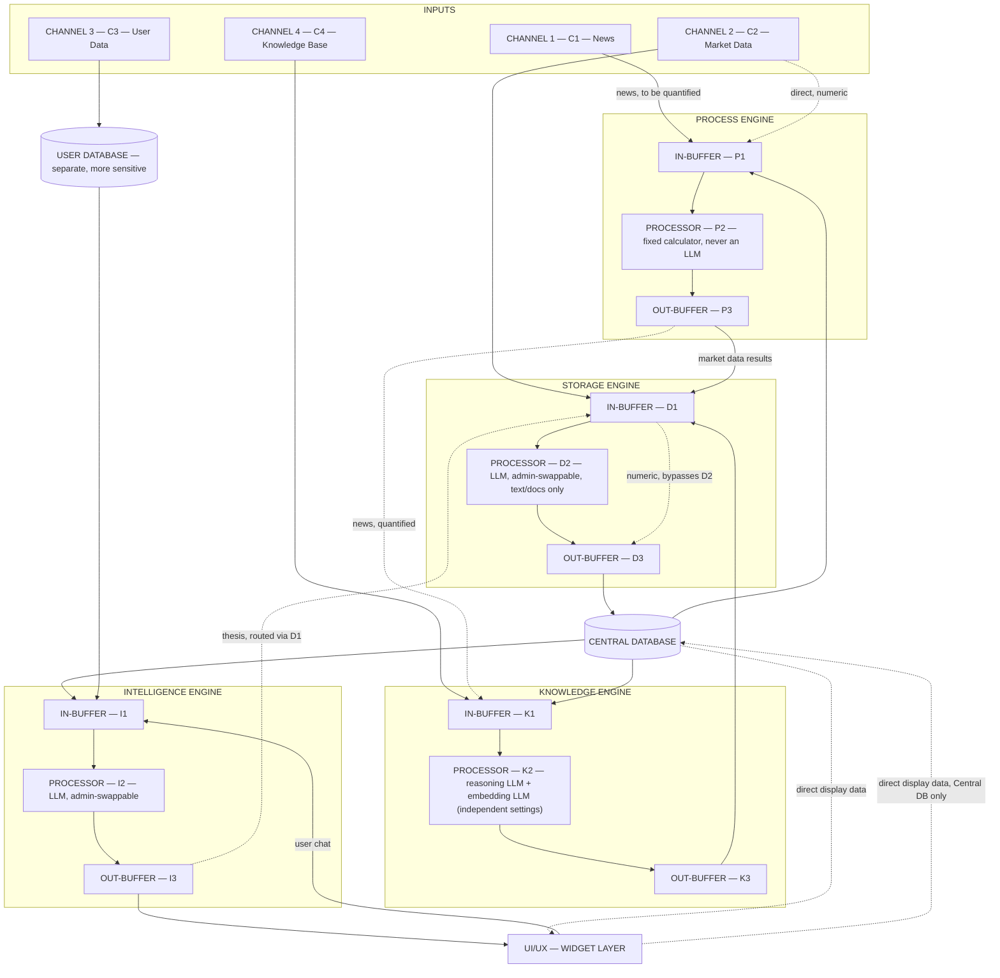
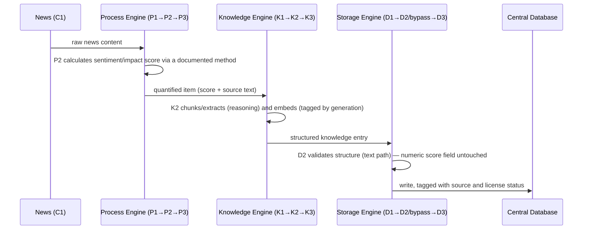
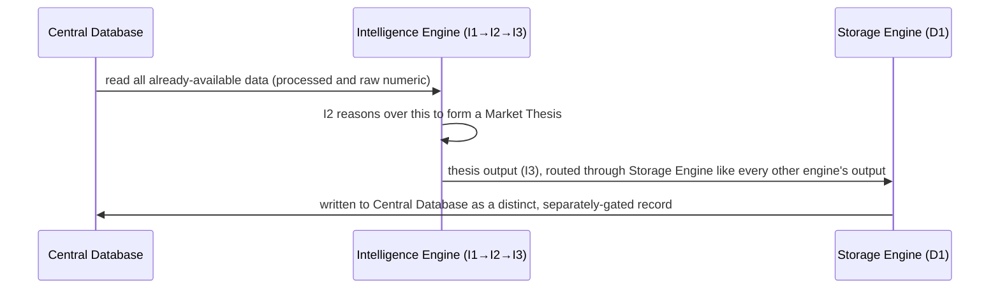
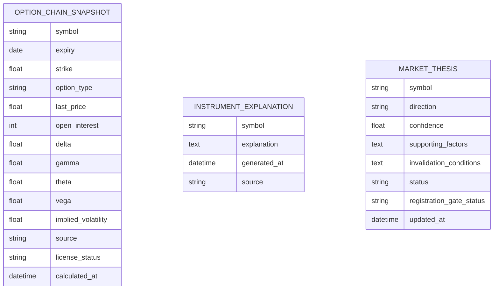

# 01 — Overall System Architecture
## Quants Report — Capinfy Private Limited

---

## Table of Contents

1. [Purpose](#1-purpose)
2. [Overview](#2-overview)
3. [Goals](#3-goals)
4. [Scope](#4-scope)
5. [Responsibilities](#5-responsibilities)
6. [Architecture](#6-architecture)
7. [Components](#7-components)
8. [Inputs](#8-inputs)
9. [Outputs](#9-outputs)
10. [Internal Workflows](#10-internal-workflows)
11. [External Workflows](#11-external-workflows)
12. [Business Rules](#12-business-rules)
13. [Database Interaction](#13-database-interaction)
14. [APIs](#14-apis)
15. [AI Logic](#15-ai-logic)
16. [Prompt Logic](#16-prompt-logic)
17. [Error Handling](#17-error-handling)
18. [Security Considerations](#18-security-considerations)
19. [Dependencies](#19-dependencies)
20. [Assumptions](#20-assumptions)
21. [Edge Cases](#21-edge-cases)
22. [Performance Considerations](#22-performance-considerations)
23. [Scalability Considerations](#23-scalability-considerations)
24. [Future Improvements](#24-future-improvements)
25. [Open Questions](#25-open-questions)
26. [Decision History](#26-decision-history)
27. [Glossary](#27-glossary)
28. [References to Related Project Documents](#28-references-to-related-project-documents)

---

## 1. Purpose

This document describes the complete system architecture of Quants Report as currently decided. It exists so that any engineer — present or future, having seen none of the prior discussion — can understand exactly how the system is structured, why each structural decision was made, what has changed since earlier versions of the architecture, what remains undecided, and what rules the architecture enforces regardless of which specific feature is being built on top of it.

This document does not describe individual product features (the option chain widget, the admin panel, the login system) in their full feature-level detail — those belong in their own specification documents. It describes the architecture those features are built on top of, and the parts of those features that have direct architectural consequences (e.g., which database a feature writes to, which engine produces its numbers, whether a feature is gated).

---

## 2. Overview

Quants Report's architecture is built around a small number of independently responsible **engines**, each performing exactly one category of work, communicating with one another only through a shared **database**, never through direct calls. Above the engines sits a **Widget Layer**, which is the actual user-facing product — each widget is a composition that reads from the engines beneath it and renders one specific, validated trading workflow.

The architecture went through substantial evolution over the course of this project. An earlier five-engine model (Data, Knowledge, Intelligence, Process, UI/UX) was later replaced by the Founder's own design, which introduced the database-as-communication-bus principle, renamed the persistence-owning engine from "Data Engine" to "Storage Engine," and introduced the buffer pattern (IN-BUFFER → PROCESSOR → OUT-BUFFER) inside every engine. This document describes the **current, accepted architecture**, and flags clearly, in Section 26, where and how it differs from earlier versions.

The single most important property of this architecture, repeated and re-enforced at every stage of its design, is this: **any number shown to a user must originate from a fixed, deterministic calculation — never from an AI model's judgment.** Every other architectural decision in this document exists in service of making that property actually true in code, not just true in principle.

---

## 3. Goals

- Allow any data source (market data vendor, broker, knowledge source, AI model) to be replaced without requiring changes to unrelated parts of the system.
- Guarantee, structurally rather than by convention, that numerical outputs shown to users are reproducible and explainable.
- Keep engines independently testable and independently replaceable by removing direct engine-to-engine dependencies.
- Support a regulatory posture in which the platform can be built and internally tested freely, while strictly gating what is shown externally until the relevant registration is complete.
- Support a single architecture that scales from one user (the Founder, internal testing) to many, without requiring a structural rebuild at the point of going live.

---

## 4. Scope

This document covers the engine architecture, the data flow between engines and the database(s), the buffer pattern, the AI-vs-fixed-calculator processor distinction, the Widget Layer's relationship to the engines, the two-database split, and the architectural implications of the major features discussed to date (Market Thesis, the personal knowledge base feature, order routing, the admin panel, and user login/plans).

Out of scope for this document: the column-level database schema (a separate, follow-on document, as noted in the Engine Specification), the visual design of the Widget Layer, and the full feature-level specification of the admin panel, login system, or order routing UI — those are referenced here only to the extent they affect the architecture.

---

## 5. Responsibilities

| Party | Responsibility |
|---|---|
| Founder / CEO (Shekkil Erumpantakath) | Vision, product direction, prioritization, final decisions, commercial strategy. |
| CRAO (Claude, architecture role) | Architecture, technical research, critical review, design specifications, challenging assumptions. Advisory only — does not produce production code without explicit instruction. |
| CAIO (parallel AI architect) | Drafts product/architecture proposals, relayed to CRAO via the Founder for review. |
| Engineering platform (Replit / Codex) | Implementation against specifications produced by CRAO and approved by the Founder. |

---

## 6. Architecture

### 6.1 High-Level Diagram



### 6.2 Layered View

```
┌─────────────────────────────────────────────┐
│              WIDGET LAYER (product)          │
│   (option chain, future widgets — consumes    │
│    engine outputs, never calculates itself)   │
└───────────────────────┬───────────────────────┘
                         │
┌────────────┬───────────┬────────────┬─────────┐
│  STORAGE   │ KNOWLEDGE │  PROCESS   │  INTEL   │
│  ENGINE    │  ENGINE   │  ENGINE    │  ENGINE  │
│ (capability layer — never call each other directly) │
└────────────┴───────────┴────────────┴─────────┘
                         │
              ┌──────────┴──────────┐
              │   CENTRAL DATABASE   │
              │   USER DATABASE      │
              │ (single source of truth) │
              └─────────────────────┘
```

---

## 7. Components

### 7.1 Storage Engine
**Participants:** D1 (IN-BUFFER) → D2 (PROCESSOR) → D3 (OUT-BUFFER), plus a direct D1→D3 bridge bypassing D2 for numeric data.
**Behavior:** Organize, normalize, validate, store. The sole engine permitted to write to either database directly.
**Processor nature:** D2 is an LLM, swappable via an administrative setting, scoped strictly to text/document content. Numeric fields never pass through D2 under any circumstance — they use the dedicated bypass.

### 7.2 Knowledge Engine
**Participants:** K1 → K2 → K3.
**Behavior:** OCR, chunking, embedding generation, metadata extraction, knowledge structuring.
**Processor nature:** K2 has two independently swappable settings — a reasoning model (chunking/extraction/summarization, swappable at any time with no migration cost) and an embedding model (swappable at any time, but every embedding is tagged with the model-generation that produced it; only same-generation vectors are ever compared; older content migrates to a new generation via a background job).

### 7.3 Process Engine
**Participants:** P1 → P2 → P3.
**Behavior:** Mathematical calculation — indicators, Greeks, risk metrics, statistical calculation, pattern recognition.
**Processor nature:** P2 is a fixed, deterministic calculator. Never an LLM. Never swappable. The only legitimate source of any number shown to a user. Also performs the sanity check on fast-path numeric data that bypasses Storage Engine's own validation (see 7.1 and 10.2).

### 7.4 Intelligence Engine
**Participants:** I1 → I2 → I3.
**Behavior:** Market reasoning, AI conversation, trade/portfolio analysis, report generation, continuous thesis monitoring. Explains and contextualizes — never calculates a number itself.
**Processor nature:** I2 is an LLM, admin-swappable, single setting (no embedding-style split required, since this engine does not generate embeddings).

### 7.5 UI/UX Engine — Widget Layer
Sits above the four engines as the product/composition layer. Each widget consumes engine outputs through their defined interfaces; it does not calculate or reason independently. The first and currently only specified widget is the option chain + Greeks widget (see the V1 Codex Brief).

### 7.6 Central Database
Single source of truth for market data, calculated results, and knowledge entries. Written to exclusively by Storage Engine.

### 7.7 User Database
A separate database holding personal/sensitive data — broker credentials, holdings, positions, and (per the personal knowledge base feature) user-uploaded personal knowledge content. Introduced later in the project specifically because this category of data was judged more sensitive than derived/market data, and because Digital Personal Data Protection Act, 2023 compliance is materially easier when personal data is isolated in its own store with its own access controls. Storage Engine remains the sole writer to this database as well — the split is about where validated data is stored, not about which engine is allowed to write it.

---

## 8. Inputs

| Channel | Content | Source |
|---|---|---|
| C1 — News | News APIs, web scrapes, video transcripts | External |
| C2 — Market Data | jugaad-data (development), NSE, GDFL (future) | External |
| C3 — User Data | Broker info, orders, positions, holdings, preferences | External (Bring Your Own Broker) |
| C4 — Knowledge Base | Uploaded PDFs, books, web links, documents | User-supplied |

A fifth, later-introduced input category — **user-uploaded personal knowledge** (see Section 10.5) — is architecturally similar to C4 but is tagged by individual ownership and stored in the User Database rather than the Central Database.

---

## 9. Outputs

- **To the Widget Layer:** calculated numeric results (direct from Process Engine), AI-generated explanation and conversation (from Intelligence Engine), and — for specific widgets only — data read directly from either database, bypassing Intelligence Engine entirely.
- **To either database:** every engine's processed output, always routed through Storage Engine.
- **To the broker (external):** order instructions only, in the order-routing workflow (Section 11.2) — the platform never submits these itself; the user submits them independently on the broker's own platform.

---

## 10. Internal Workflows

### 10.1 News Processing

The score and the searchable knowledge entry are generated from one coherent pipeline, deliberately, so they cannot drift out of sync with each other the way two independently-run calculations could.

### 10.2 Market Data Processing
Market data takes two simultaneous paths from C2:
1. **Archive path:** C2 → Storage Engine D1 → bypasses D2 (numeric bridge) → D3 → Central Database. Unmodified, raw.
2. **Fast path:** C2 → Process Engine P1, in parallel, bypassing the database round-trip for latency-sensitive calculation. P2 performs a sanity check on this data (since it skipped Storage Engine's own validation), then performs the actual calculation. Result (P3) is then forwarded to Storage Engine D1 for normalization and persistence, the same as any other engine output.

### 10.3 User Data Processing
C3 → User Database directly (via Storage Engine, which remains the sole writer to both databases). Internally splits: numeric fields (quantities, prices) bypass D2; preference/text fields pass through D2 for normalization. No direct fast-path to Process Engine currently exists for this channel — there is no feature yet that requires real-time calculation on raw user data (see Section 25, Open Questions, and Section 12 on why this is deliberate, not an oversight).

### 10.4 Knowledge Base Processing
C4 → Knowledge Engine K1 → K2 (OCR/chunking/extraction, tagged embedding) → K3 → Storage Engine D1 → D3 → Central Database.

### 10.5 Personal Knowledge Base Processing (User-Owned)
A later architectural addition. Users may upload their own knowledge files or links, processed through the same Knowledge Engine pipeline as platform knowledge, but with one additional dimension: every entry is tagged not only with its embedding model-generation (Section 7.2) but with **ownership** — which specific user it belongs to. When Intelligence Engine retrieves context for a query, it draws from the platform's shared knowledge and that specific user's own personal knowledge — never another user's. Personal knowledge entries are stored in the User Database, not the Central Database, consistent with the rationale in Section 7.7.

**UI rule, architectural in consequence:** when Intelligence Engine's response incorporates content drawn from a user's own uploaded material, that material must be visibly and unambiguously labeled as the user's own content being reflected back to them — never blended with or presented as the platform's own analysis. This matters most in the specific case where a user has uploaded material containing actual buy/sell calls (e.g., old tip-channel notes); the platform reflecting that back must not appear to be the platform's own voice.

### 10.6 "Why Is This Instrument Moving" Explanation Generation
A mandatory, scheduled background process (not triggered by a specific user's query) that runs for instruments as data arrives, producing a stored, instrument-level, backward-looking explanation — generated with no knowledge of which user, if any, will ever read it. This explanation is then served to any user requesting it via a database read, not a fresh generation per request. This satisfies two needs simultaneously: it avoids the cost of regenerating the same explanation for every user who asks, and it makes a key compliance property structural rather than a matter of self-discipline — because the explanation is generated before any specific reader or position exists in context, it cannot be personalized, by construction.

**Whether this is generated eagerly for every instrument, or lazily on first request and then cached, is a cost decision, not a compliance decision** — both approaches preserve the same compliance property as long as the generation logic remains blind to the requester.

### 10.7 Market Thesis Generation and Persistence

Market Thesis is derived entirely from data already in the Central Database — no new external input is required. The write path is **Database → Intelligence Engine → Storage Engine → Database**, not a direct Intelligence-Engine-to-database write, preserving the rule that Storage Engine is the only engine that writes directly to either database.

---

## 11. External Workflows

### 11.1 Broker Connectivity (Bring Your Own Broker)
Each user connects their own broker account (initially Zerodha) via OAuth. The platform consumes only the data that specific user is already personally entitled to receive — it does not act as a market-data redistribution service. This is the architectural basis for treating Quants Report as an analytics layer rather than a data vendor for anything broker-sourced.

### 11.2 Order Routing
```
1. User logs in.
2. Platform fetches the user's account data from their broker account.
3. User analyzes the market using Quants Report.
4. User creates a new order inside Quants Report, to be sent to their broker account.
5. User reviews the order once more before sending it.
6. User executes the order from their broker's own platform — e.g., by independently
   logging into the broker's website and clicking "Place Order" there. Quants Report
   does not place this order itself.
7. Quants Report receives the execution details via API (filled, rejected, or any other status).
8. Quants Report displays the order's details and current state through neutral,
   easy-to-understand infographics — no suggestions, no notifications, no interpretation.
```
Step 6 is the architecturally significant step: execution happens on the broker's own platform, after independent re-authentication, not inside Quants Report. Step 8 is significant for a different reason — it is data reporting (a fact about something that already happened), not advice, as long as it remains neutral and uninterpreted.

---

## 12. Business Rules

- No number shown to a user may originate from anything other than Process Engine's fixed calculator.
- Storage Engine is the only engine permitted to write to either database directly.
- Every buffer (IN/OUT, in every engine) is stateless. Nothing persists outside the database(s).
- Building and internally testing any capability is unrestricted. Showing its output to anyone other than the Founder is gated until the relevant registration is complete ("build vs. publish").
- "Internal testing" means the Founder's own account and credentials only — not a beta group of any size.
- Explaining an **instrument** (backward-looking, identical regardless of who asks) is treated as safe market information. Explaining a **position** (forward-looking, or dependent on who is asking) is treated as advice-shaped and is not built without the relevant registration. The practical test: would the explanation be exactly the same sentence if shown to someone who does not hold that position? If yes, it is instrument-level. If the explanation only makes sense because it is about that specific holding, it is position-level.
- Market Thesis and any confidence/probability output are never placed behind a paid plan tier. Once the relevant registration is complete, every user may access these features regardless of plan, subject only to a separate, non-compliance-related usage time limit for those on free tiers. Registration status and plan tier are two independent checks — never combined into one.
- A registration-status flag (the feature-level equivalent of the data `license_status` already enforced in code) must gate Market Thesis output independently of the billing/plan system entirely.
- Personalized, holdings-specific interpretation (risk scoring, hedging suggestions, "why did my position move") requires Investment Adviser registration, a separate track from the Research Analyst registration that gates Market Thesis and general market intelligence.
- Any AI-generated content reflecting back a user's own uploaded material must be visibly attributed as such, never blended with the platform's own analysis without distinction.

---

## 13. Database Interaction

### 13.1 Two-Database Model
| Database | Holds | Written By |
|---|---|---|
| Central Database | Market data, calculated results (Greeks, indicators), platform knowledge entries, quantified news, instrument-level "why" explanations, Market Thesis records | Storage Engine only |
| User Database | Broker credentials, holdings, positions, user preferences, personal knowledge base uploads | Storage Engine only |

### 13.2 The Widgets↔Database Direct Shortcut
A deliberate, approved exception exists for specific widgets that need to display already-computed data without requiring Intelligence Engine's reasoning step. This shortcut is **scoped to the Central Database only.** It does not extend to the User Database — direct, unvalidated writes into the database holding broker tokens and personal holdings are a materially different risk than into the database holding cached market summaries, and the shortcut was reasoned through specifically for low-stakes content (e.g., display preferences), not sensitive personal data.

### 13.3 Read Patterns
Knowledge Engine, Process Engine, and Intelligence Engine all read from the Central Database as needed (`DB → K1`, `DB → P1`, `DB → I1`). Intelligence Engine additionally reads from the User Database (`UDB → I1`) when a query requires personal context (e.g., a user's own uploaded knowledge, or — once built — their holdings).

### 13.4 Indicative Schema Sketch (Central Database)
*(Column-level detail is out of scope here — see Section 28. This is illustrative only.)*



---

## 14. APIs

No formal external API specification exists yet (flagged in Section 25 and the Documentation Standards Checklist). The architecturally relevant external integration points currently identified are:

- **Zerodha Kite Connect** (OAuth-based broker connectivity; free Personal tier assumed sufficient for holdings/positions/orders, paid tier required for live/historical market data via this route — see Section 20, Assumptions).
- **jugaad-data** (not a formal API; an unofficial library reading NSE's own public website).
- **Claude API / other LLM provider APIs** (consumed by D2, K2, and I2 — see Section 15).

---

## 15. AI Logic

Three of the four engine processors are AI-based; one is deliberately not.

| Processor | AI? | Swappable? | Scope |
|---|---|---|---|
| D2 (Storage Engine) | Yes | Yes, admin panel | Text/document content only — never numeric fields |
| K2 (Knowledge Engine) | Yes — two independent models | Yes, independently | Reasoning (chunking/extraction) and embedding (generation-tagged) |
| P2 (Process Engine) | **No** | **No, never** | All numeric calculation |
| I2 (Intelligence Engine) | Yes | Yes, admin panel | Reasoning, conversation, explanation |

This split exists so that "which AI model are we using" can change freely as better models become available, without that choice ever being able to affect the correctness of a number shown to a user. The admin-panel swap capability is a platform-operator decision, never exposed to end users.

---

## 16. Prompt Logic

No literal prompt templates have been written yet — this remains implementation detail for whichever engineering platform builds each engine's I2/D2/K2 calls. The architectural constraints prompt logic must respect, established in this project, are:

- I2's prompts must never be asked to produce a number, score, or probability directly — only to explain a number that Process Engine has already produced and that is passed into context.
- For the "why is this instrument moving" explanation (Section 10.6), the prompt and its inputs must contain no information identifying a specific requesting user or their position — only the instrument and the relevant market/news context — so the output is structurally incapable of being personalized.
- For Market Thesis generation, I2's prompt operates only on data already present in the Central Database (Section 10.7) — it does not have a separate, privileged data source unavailable to the rest of the system.

---

## 17. Error Handling

Explicitly defined so far:
- Storage Engine's cleaning step rejects malformed numeric rows (non-positive prices, high<low, negative volume) rather than attempting to silently correct them.
- Process Engine's P2 performs an equivalent sanity check specifically on fast-path data that bypassed Storage Engine's own validation (Section 10.2), since nothing else checks that data first.
- The reference implementation (`historical_data_store.py`) returns an explicit accepted/rejected count on every ingestion call, so a caller always knows what was dropped rather than discovering it later.
- A `PermissionError` is explicitly raised (not silently filtered) when a read is requested `for_publish=True` against data whose license status does not permit display — a partial, silently-incomplete dataset was deliberately judged worse than a loud failure.

Not yet defined: error handling for broker API failures/timeouts, AI provider outages, or partial failures during the multi-step news pipeline (Section 10.1).

---

## 18. Security Considerations

- Agreed to follow OWASP-aligned practice for the login/payment/broker-credential system once built: encrypted credentials (never plaintext), least-privilege roles for the admin panel's Super User tier, rate-limiting on login/OAuth endpoints.
- Digital Personal Data Protection Act, 2023 compliance is a named obligation for any end-user personal data, and is part of the rationale for the User Database split (Section 7.7).
- No formal threat model or security architecture document exists yet (Section 25).
- Backups are agreed in principle (automated, off-platform, for all data) but no written schedule or procedure exists yet. Source code backup is already solved by the use of GitHub as version control.

---

## 19. Dependencies

- `jugaad-data` (Python library; unofficial, no uptime guarantee) for development-phase market data.
- Zerodha Kite Connect (OAuth and, where used, the paid Connect API tier for live/historical data).
- An LLM provider (Claude, or another model swapped in via the admin panel) for D2, K2, and I2.
- GitHub for source control.
- A hosting/engineering platform — Replit was the original choice; Codex has since also been used for build-brief generation. Wherever code actually executes, that environment must have outbound network access to the relevant external sources (explicitly confirmed as a real constraint — the documentation-generation sandbox used earlier in this project could not reach NSE's website at all).

---

## 20. Assumptions

- That Zerodha's free Kite Connect "Personal" tier covers holdings, positions, and order data without requiring the paid Connect subscription — repeatedly flagged as needing direct verification on the developer portal; not yet confirmed in this documentation set.
- That `jugaad-data` will continue to function reliably through the prototype phase.
- That generation-tagging embeddings and background migration is sufficient to make embedding-model swaps safe in practice at the data volumes this project will actually reach — not yet tested at any real scale.
- That instrument-level "why" explanations can be generated with no knowledge of the requesting user without losing usefulness — a design intent, not yet validated against real user queries.

---

## 21. Edge Cases

- A news item that is ambiguous or low-confidence to quantify (Section 10.1) — no defined fallback behavior yet for when Process Engine's sentiment/impact scoring method produces a low-confidence result.
- A user who uploads personal knowledge content containing third-party copyrighted material they do not have the right to upload (Section 10.5) — mitigated by a Terms of Service warranty and takedown mechanism, but the takedown mechanism itself is not yet specified.
- A Market Thesis whose underlying data changes mid-generation (i.e., new information arrives in the Central Database while Intelligence Engine is still reasoning over the previous snapshot) — no defined behavior yet for this race condition.
- An embedding-model swap occurring while a background migration from a previous swap is still in progress — no defined behavior yet for overlapping migrations.

---

## 22. Performance Considerations

- The fast path for market data (Section 10.2) exists specifically to avoid a database round-trip for latency-sensitive, user-is-waiting calculations — an explicit, named exception to "engines only communicate via the database," made for performance reasons.
- Pre-computing instrument-level explanations (Section 10.6) trades background compute cost for near-zero latency on the user-facing read.
- No load testing, latency targets, or performance benchmarks have been defined yet beyond the general principle above.

---

## 23. Scalability Considerations

- The database-as-communication-bus pattern was explicitly flagged, at the point it was introduced, as relocating coupling into the database schema rather than eliminating it — schema changes must be treated as a versioned contract, not incidental storage, as the system grows.
- Writes from Storage/Knowledge/Process Engines that the user is not directly waiting on should be asynchronous/non-blocking, so the "every engine writes" pattern does not become a bottleneck as more engines write more often — noted as a recommendation, not yet implemented.
- The two-database split (Section 7.7) was made partly with this in mind: personal data and derived/market data have different growth patterns and different access patterns, and isolating them keeps either one from becoming a scaling constraint on the other.

---

## 24. Future Improvements

- A formal, column-level database schema document for both databases.
- A formal API specification.
- Resolution of the embedding-migration overlap edge case (Section 21).
- Investment Adviser registration research, to the same depth already completed for Research Analyst registration.
- A UI/UX design system for the Widget Layer, beyond the single specified widget.
- Eventual migration toward proprietary, in-house AI models — named in the earliest architecture discussions as a long-term aspiration, explicitly not a near-term roadmap item.

---

## 25. Open Questions

- Does User Data (C3) ever need a direct fast-path to Process Engine, the way Market Data does? Currently, no — because the only features that would need it (personalized, portfolio-level calculation) are on hold pending Investment Adviser registration. This should be revisited if and when that registration work begins.
- What is the exact fallback behavior when Process Engine's news-sentiment scoring method produces a low-confidence result (Section 21)?
- Should eager (pre-compute for every instrument) or lazy (compute on first request, then cache) generation be used for instrument-level explanations (Section 10.6)? Identified explicitly as a cost decision for the Founder to make, not yet decided.
- What does the takedown mechanism for personal knowledge base content actually look like (Section 21)?

---

## 26. Decision History

This section exists specifically to resolve conflicting descriptions of the architecture found across earlier project documents, per instruction. Where a conflict exists, the **latest accepted version**, as used throughout the rest of this document, is stated explicitly.

| Topic | Earlier Decision | Later / Current Decision | Status |
|---|---|---|---|
| Engine naming | The persistence-owning engine was called **"Data Engine"** in the original five-engine model (`quants-report-architecture-vision.html`, `quants-report-architecture.pdf`). | The Founder's own diagram and all subsequent discussion call it **"Storage Engine."** | **Storage Engine is current.** "Data Engine" should be read as the same role under an earlier name when encountered in older documents. |
| Engine-to-engine communication | Original model implied engines could pass context to one another somewhat directly (e.g., an early draft had Intelligence Engine handing context to Process Engine directly). | **Engines never communicate directly. The database is the sole communication medium**, including for the Process-Engine-to-Intelligence-Engine "explain this number" handoff, which now happens via a database write followed by a database read. | **Database-as-bus is current.** |
| Buffer terminology | Originally labeled **"Room"** (IN-ROOM / OUT-ROOM) in the first hand-drawn diagram and the originating text memo. | Renamed to **"Buffer"** (IN-BUFFER / OUT-BUFFER) at the Founder's explicit request, on the basis that "buffer" correctly conveys temporariness where "room" did not. | **Buffer is current.** |
| Channel lettering (C1–C4) | The original "Architecture Evolution" memo defined **C1 = User Data, C2 = Market Data, C3 = News, C4 = Knowledge Base.** | The Founder's own hand-drawn diagrams, after correction across three iterations, confirmed **C1 = News, C2 = Market Data, C3 = User Data, C4 = Knowledge Base.** | **The hand-drawn lettering is current** — C1 and C3 are swapped relative to the original memo. This is a real, confirmed change, not a transcription error. |
| News routing | An early draft had News (C1) routed in parallel directly to both Storage Engine and Process Engine. | Corrected to a **sequential chain**: C1 → Process Engine (quantify) → Knowledge Engine (chunk/embed, together with the score) → Storage Engine → Database. | **Sequential chain is current** — this was an explicit, reasoned improvement, not a simplification. |
| Engine-to-database writers | An early draft had Knowledge Engine and Process Engine writing to the database directly, in parallel with Storage Engine. | Corrected so that **Storage Engine is the sole writer to either database.** Knowledge Engine's and Process Engine's outputs both route back through Storage Engine's own buffer first. | **Sole-writer model is current.** |
| K2 embedding swap risk | Originally treated as a single swappable LLM setting, with the embedding-incompatibility risk unaddressed. | Split into **two independent settings** (reasoning model, freely swappable; embedding model, swappable with generation-tagging and background migration). | **Split-setting model is current.** |
| Database count | Originally a single, central database for everything. | The Founder proposed, and it was agreed, that **User Data warrants its own, separate database**, given its higher sensitivity relative to derived/market data. | **Two-database model is current.** |
| Widgets↔Database shortcut scope | Originally approved as a general two-way shortcut between Widgets and "the database," undifferentiated. | Once the two-database split occurred, this shortcut was explicitly scoped to **the Central Database only** — it does not extend to the User Database. | **Central-Database-only scope is current.** |
| Market Thesis write path | Initially an open question (Intelligence Engine had no database write path at all). | Resolved: Intelligence Engine's thesis output **routes through Storage Engine** (I3 → D1, the same pattern as every other engine), rather than being granted its own direct database-write exception. | **Routed-through-Storage-Engine is current.** |
| Personalized data explanation, compliance classification | An earlier exchange in this project filed "execution-update monitoring" generally under the same Investment-Adviser-gated bucket as personalized holdings analysis. | Refined: **neutral reporting of a user's own data (fill status, current holdings) does not require Investment Adviser registration; only interpretation of that data (scoring, alerts, suggestions) does.** | **The refined, narrower classification is current.** |

---

## 27. Glossary

See the Master Index (`00_Master_Index.md`), Section 8, for the full glossary shared across all project documents. Terms specific to this document's level of detail:

| Term | Meaning |
|---|---|
| Fast path | The direct Market-Data-to-Process-Engine route that bypasses the database round-trip, for latency-sensitive, user-is-waiting calculations only. |
| Generation-tagging | Tagging every embedding with the model that produced it, so swapped embedding models never have their output compared against incompatible older vectors. |
| Instrument-level vs. position-level | The distinction determining whether an explanation is safe market information (instrument-level, identical regardless of who's asking) or advice-shaped (position-level, dependent on the specific holder). |

---

## 28. References to Related Project Documents

- `00_Master_Index.md` — full repository index, glossary, and abbreviations.
- `quants-report-engine-specification.md` / `.docx` — the prose/tabular predecessor to this document; this document supersedes it where they conflict, per Section 26 above, but the Data Handling Matrix contained there remains a useful item-by-item reference not duplicated in full here.
- `quants-report-architecture-diagram.mermaid` — the standalone diagram file this document's Section 6.1 reproduces.
- `quants-report-srs.pdf` — formal requirements built on top of this architecture.
- `quants-report-v1-codex-brief.md` — the current build target, scoped to a single widget on top of this architecture.
- `market_data_connector.py`, `historical_data_store.py` — reference code implementing the Storage Engine pattern described in Sections 7.1 and 10.2.
- Documentation still needed that would extend this document once written: a column-level schema document (Section 13.4), a formal API specification (Section 14), and an Investment Adviser registration research document (Section 24).
