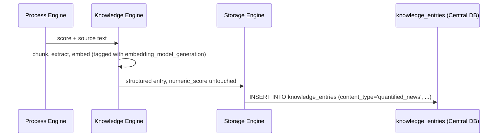

# 02 — Complete Database Design
## Quants Report — Capinfy Private Limited

> **Status note:** Both `01_Architecture.md` and `03_Data_Engine.md` explicitly marked column-level schema as out of scope, deferred to a dedicated document. This is that document. Everything below is a new synthesis, designed specifically for this document, from data items referenced throughout the project — it has not been previously reviewed at the column level and should be treated as a first complete draft, not yet implemented or tested.

---

## Table of Contents

1. [Purpose](#1-purpose)
2. [Overview](#2-overview)
3. [Goals](#3-goals)
4. [Scope](#4-scope)
5. [Responsibilities](#5-responsibilities)
6. [Architecture](#6-architecture)
7. [Components — Central Database Tables](#7-components--central-database-tables)
8. [Components — User Database Tables](#8-components--user-database-tables)
9. [Inputs](#9-inputs)
10. [Outputs](#10-outputs)
11. [Internal Workflows](#11-internal-workflows)
12. [External Workflows](#12-external-workflows)
13. [Business Rules](#13-business-rules)
14. [Database Interaction](#14-database-interaction)
15. [APIs](#15-apis)
16. [AI Logic](#16-ai-logic)
17. [Prompt Logic](#17-prompt-logic)
18. [Error Handling](#18-error-handling)
19. [Security Considerations](#19-security-considerations)
20. [Dependencies](#20-dependencies)
21. [Assumptions](#21-assumptions)
22. [Edge Cases](#22-edge-cases)
23. [Performance Considerations](#23-performance-considerations)
24. [Scalability Considerations](#24-scalability-considerations)
25. [Future Improvements](#25-future-improvements)
26. [Open Questions](#26-open-questions)
27. [Decision History](#27-decision-history)
28. [Glossary](#28-glossary)
29. [References to Related Project Documents](#29-references-to-related-project-documents)

---

## 1. Purpose

This document is the single source of truth for the column-level structure of both Quants Report databases — the **Central Database** and the **User Database**. Every other document in this repository describes data items in prose (e.g., "a quantified news item," "a Market Thesis record"); this document is where those prose descriptions become actual tables, columns, types, and constraints.

---

## 2. Overview

Quants Report uses two separate databases, a decision made explicitly because personal/broker data was judged categorically more sensitive than derived/market data (see `01_Architecture.md`, Section 7.7). **Storage Engine is the only component permitted to write to either database** (`03_Data_Engine.md`, Section 13). Every table in this document, in both databases, is written exclusively by Storage Engine, with the one named exception described in Section 14.2.

The schema is designed around three cross-cutting tagging concepts that appear repeatedly throughout this project and are implemented here as actual columns:

1. **`license_status`** — carried by nearly every record that originates from external market/news data, governing whether it may be shown to anyone other than the Founder.
2. **`embedding_model_generation`** — carried by every stored embedding, preventing incompatible vectors from ever being compared against each other.
3. **`owner_id`** — carried by personal knowledge base entries, preventing one user's content from ever being retrieved for another user.

A fourth concept, **platform-wide regulatory status**, is implemented not as a per-record tag but as a single, separate configuration table (Section 7.9) — explained explicitly in Section 27, as this is a refinement of an earlier, less precise sketch.

---

## 3. Goals

- Every column-level decision should be traceable to an actual requirement stated elsewhere in this project, not invented for this document.
- The schema must make incorrect cross-user data access and incorrect display of unlicensed data structurally difficult, not merely discouraged by convention.
- The schema must support the buffer/processor pattern used by every engine without requiring any engine other than Storage Engine to hold a database connection.

---

## 4. Scope

This document covers full table definitions for both databases, their relationships, indexing and constraint reasoning, and the data lifecycle through each table. It does not cover the specific ORM or query-building approach an engineering platform might use to interact with these tables — that is an implementation detail left to the build phase.

---

## 5. Responsibilities

| Party | Responsibility |
|---|---|
| Storage Engine | Sole writer to every table in both databases. |
| Knowledge Engine, Process Engine, Intelligence Engine | Read-only access to the Central Database (and, for Intelligence Engine, the User Database) as needed. None write directly. |
| Widget Layer | Read-only access via the approved Central-Database-only shortcut (Section 14.2); otherwise reads only via Intelligence Engine. |
| Admin Panel (future) | Reads and writes the configuration tables in Section 7.8–7.9 only — never the data tables directly. |

---

## 6. Architecture

```mermaid
erDiagram
    CENTRAL_DB ||--o{ OHLC_BARS : contains
    CENTRAL_DB ||--o{ OPTION_CHAIN_SNAPSHOT : contains
    CENTRAL_DB ||--o{ KNOWLEDGE_ENTRIES : contains
    CENTRAL_DB ||--o{ INSTRUMENT_EXPLANATION : contains
    CENTRAL_DB ||--o{ MARKET_THESIS : contains
    CENTRAL_DB ||--o{ PLATFORM_REGULATORY_STATUS : contains
    CENTRAL_DB ||--o{ ADMIN_DATA_SOURCE_CONFIG : contains
    CENTRAL_DB ||--o{ ADMIN_LLM_CONFIG : contains

    USER_DB ||--o{ USERS : contains
    USER_DB ||--o{ ADMIN_USERS : contains
    USER_DB ||--o{ BROKER_CONNECTIONS : contains
    USER_DB ||--o{ HOLDINGS : contains
    USER_DB ||--o{ ORDERS : contains
    USER_DB ||--o{ USER_PREFERENCES : contains
    USER_DB ||--o{ PERSONAL_KNOWLEDGE_ENTRIES : contains
    USER_DB ||--o{ USAGE_AUDIT_LOG : contains

    USERS ||--o{ BROKER_CONNECTIONS : has
    USERS ||--o{ HOLDINGS : has
    USERS ||--o{ ORDERS : places
    USERS ||--|| USER_PREFERENCES : has
    USERS ||--o{ PERSONAL_KNOWLEDGE_ENTRIES : owns
```



---

## 7. Components — Central Database Tables

### 7.1 `ohlc_bars`
Historical price data. Directly implements the schema already used in the `historical_data_store.py` reference code — this document formalizes it rather than redesigning it.

```sql
CREATE TABLE ohlc_bars (
    symbol          TEXT NOT NULL,
    bar_date        DATE NOT NULL,
    open            NUMERIC NOT NULL CHECK (open > 0),
    high            NUMERIC NOT NULL CHECK (high > 0),
    low             NUMERIC NOT NULL CHECK (low > 0),
    close           NUMERIC NOT NULL CHECK (close > 0),
    volume          BIGINT NOT NULL CHECK (volume >= 0),
    open_interest   BIGINT,
    source          TEXT NOT NULL,
    license_status  TEXT NOT NULL CHECK (license_status IN
                       ('internal_only','licensed_research_only','licensed_display','licensed_personal')),
    ingested_at     TIMESTAMPTZ NOT NULL DEFAULT now(),
    PRIMARY KEY (symbol, bar_date, source)
);
CREATE INDEX idx_ohlc_symbol_date ON ohlc_bars (symbol, bar_date);
```
The `CHECK` constraints on `open`, `high`, `low`, `close`, and `volume` are the database-level enforcement of the same validation logic already implemented in `historical_data_store.py`'s `_is_clean()` function — a deliberate, defense-in-depth duplication, not a redundancy to be removed. Application code rejecting bad rows and the database refusing to store them are two independent safeguards.

### 7.2 `option_chain_snapshot`
Calculated option data — the table the V1 build target (`quants-report-v1-codex-brief.md`) writes to.

```sql
CREATE TABLE option_chain_snapshot (
    id                      BIGSERIAL PRIMARY KEY,
    symbol                  TEXT NOT NULL,
    expiry                  DATE NOT NULL,
    strike                  NUMERIC NOT NULL,
    option_type             TEXT NOT NULL CHECK (option_type IN ('CE','PE')),
    last_price              NUMERIC,
    open_interest           BIGINT,
    volume                  BIGINT,
    delta                   NUMERIC,
    gamma                   NUMERIC,
    theta                   NUMERIC,
    vega                    NUMERIC,
    implied_volatility      NUMERIC,
    spot_price_used         NUMERIC NOT NULL,
    risk_free_rate_used     NUMERIC NOT NULL,
    source                  TEXT NOT NULL,
    license_status          TEXT NOT NULL,
    calculated_at           TIMESTAMPTZ NOT NULL DEFAULT now()
);
CREATE INDEX idx_chain_symbol_expiry ON option_chain_snapshot (symbol, expiry, calculated_at DESC);
```
`spot_price_used` and `risk_free_rate_used` are stored on every row, not just configured globally, specifically so that any historical calculation can be audited later against the inputs actually used at the time — consistent with the project-wide rule that any number must trace to a reproducible methodology.

### 7.3 `knowledge_entries`
Platform-curated knowledge and quantified news — never personal content (see `personal_knowledge_entries`, Section 8.7, for that).

```sql
CREATE TABLE knowledge_entries (
    id                          BIGSERIAL PRIMARY KEY,
    content_type                TEXT NOT NULL CHECK (content_type IN ('platform_document','quantified_news')),
    chunk_text                  TEXT NOT NULL,
    embedding                   VECTOR(1536),
    embedding_model_generation  TEXT NOT NULL,
    related_symbol              TEXT,
    numeric_score                NUMERIC,
    source                       TEXT NOT NULL,
    license_status                TEXT NOT NULL,
    created_at                    TIMESTAMPTZ NOT NULL DEFAULT now()
);
CREATE INDEX idx_knowledge_symbol ON knowledge_entries (related_symbol) WHERE related_symbol IS NOT NULL;
```
`numeric_score` exists specifically to hold the Process-Engine-calculated sentiment/impact value for a quantified news item, stored alongside (not inside) the chunked text and embedding produced by Knowledge Engine — preserving the rule, established in `04_Knowledge_Engine.md` Section 7.2, that this numeric value is never altered by an AI processing step.

### 7.4 `instrument_explanation`
The "why is this instrument moving" explanations, generated instrument-blind (see `01_Architecture.md`, Section 10.6).

```sql
CREATE TABLE instrument_explanation (
    id              BIGSERIAL PRIMARY KEY,
    symbol          TEXT NOT NULL,
    explanation     TEXT NOT NULL,
    generated_at    TIMESTAMPTZ NOT NULL DEFAULT now(),
    source          TEXT NOT NULL
);
CREATE INDEX idx_instrument_explanation_symbol ON instrument_explanation (symbol, generated_at DESC);
```
No `owner_id` or any user-identifying column exists on this table, by design — its entire compliance property depends on this record being structurally incapable of referencing who might read it.

### 7.5 `market_thesis`
```sql
CREATE TABLE market_thesis (
    id                          BIGSERIAL PRIMARY KEY,
    symbol                       TEXT NOT NULL,
    direction                    TEXT NOT NULL CHECK (direction IN ('bullish','bearish','neutral')),
    confidence                   NUMERIC NOT NULL CHECK (confidence BETWEEN 0 AND 1),
    expected_validity_minutes    INTEGER,
    supporting_factors           TEXT[],
    invalidation_conditions      TEXT[],
    status                       TEXT NOT NULL CHECK (status IN
                                    ('active','strengthened','revised','weakening','invalidated','closed')),
    created_at                    TIMESTAMPTZ NOT NULL DEFAULT now(),
    updated_at                    TIMESTAMPTZ NOT NULL DEFAULT now()
);
CREATE INDEX idx_thesis_symbol_status ON market_thesis (symbol, status);
```
Deliberately **no registration-gate column on this table.** See Section 7.9 and Section 27 for why that check lives elsewhere.

### 7.6 `platform_regulatory_status`
A single-row configuration table, checked by the application layer before any Market Thesis or position-interpretation content is served to anyone other than the Founder.

```sql
CREATE TABLE platform_regulatory_status (
    id                      INT PRIMARY KEY DEFAULT 1 CHECK (id = 1),
    ra_registered            BOOLEAN NOT NULL DEFAULT false,
    ra_registration_date     DATE,
    ia_registered            BOOLEAN NOT NULL DEFAULT false,
    ia_registration_date     DATE,
    updated_at               TIMESTAMPTZ NOT NULL DEFAULT now()
);
```
This is the database-level equivalent of `assert_safe_to_publish()` (`03_Data_Engine.md`, Section 7.3) applied to a *feature* (Market Thesis) rather than a *data source*. Every read of `market_thesis` intended for a non-Founder user must check `ra_registered = true` here first, independent of which subscription plan that user is on.

### 7.7 `admin_data_source_config`
```sql
CREATE TABLE admin_data_source_config (
    engine_component    TEXT PRIMARY KEY,
    active_connector     TEXT NOT NULL,
    license_status         TEXT NOT NULL,
    swapped_at             TIMESTAMPTZ NOT NULL DEFAULT now(),
    swapped_by             BIGINT
);
```
The database-backed counterpart to swapping `MarketDataConnector` implementations (`03_Data_Engine.md`, Section 7.3) via the admin panel rather than a code change.

### 7.8 `admin_llm_config`
```sql
CREATE TABLE admin_llm_config (
    engine_processor    TEXT PRIMARY KEY CHECK (engine_processor IN ('D2','K2_reasoning','K2_embedding','I2')),
    active_model          TEXT NOT NULL,
    swapped_at             TIMESTAMPTZ NOT NULL DEFAULT now(),
    swapped_by             BIGINT
);
```
Note `P2` deliberately does not and must never appear as a valid value of `engine_processor` here — Process Engine's calculator is not, and must never become, admin-swappable (see `01_Architecture.md`, Section 15).

---

## 8. Components — User Database Tables

### 8.1 `users`
```sql
CREATE TABLE users (
    id                BIGSERIAL PRIMARY KEY,
    email             TEXT NOT NULL UNIQUE,
    password_hash     TEXT NOT NULL,
    plan_tier         TEXT NOT NULL CHECK (plan_tier IN ('free_trial','premium','professional','ultimate')),
    trial_started_at  TIMESTAMPTZ,
    trial_ends_at     TIMESTAMPTZ,
    created_at        TIMESTAMPTZ NOT NULL DEFAULT now()
);
```
`plan_tier` governs usage limits and support level only. It must never be read by any code path that decides whether to serve Market Thesis or probability content — that decision reads `platform_regulatory_status` (Section 7.6) exclusively, a deliberate separation enforced at the schema level by these two facts living in entirely unrelated tables in different databases.

### 8.2 `admin_users`
```sql
CREATE TABLE admin_users (
    id            BIGSERIAL PRIMARY KEY,
    email         TEXT NOT NULL UNIQUE,
    password_hash TEXT NOT NULL,
    role          TEXT NOT NULL CHECK (role IN ('admin','super_user')),
    created_by    BIGINT REFERENCES admin_users(id),
    created_at    TIMESTAMPTZ NOT NULL DEFAULT now()
);
```
`created_by` self-references this table, directly implementing the admin panel requirement that Super Users may create other users (and, by extension, are themselves tracked back to whichever admin created them).

### 8.3 `broker_connections`
```sql
CREATE TABLE broker_connections (
    id              BIGSERIAL PRIMARY KEY,
    user_id          BIGINT NOT NULL REFERENCES users(id) ON DELETE CASCADE,
    broker_name       TEXT NOT NULL,
    access_token       TEXT NOT NULL,
    refresh_token      TEXT,
    connected_at        TIMESTAMPTZ NOT NULL DEFAULT now(),
    UNIQUE (user_id, broker_name)
);
```
`access_token` and `refresh_token` must be encrypted at rest (Section 19). This table is the schema-level implementation of the Bring Your Own Broker model — one row per user per broker, never shared.

### 8.4 `holdings`
```sql
CREATE TABLE holdings (
    id              BIGSERIAL PRIMARY KEY,
    user_id          BIGINT NOT NULL REFERENCES users(id) ON DELETE CASCADE,
    symbol           TEXT NOT NULL,
    quantity          NUMERIC NOT NULL,
    average_price     NUMERIC NOT NULL,
    fetched_at         TIMESTAMPTZ NOT NULL DEFAULT now()
);
CREATE INDEX idx_holdings_user ON holdings (user_id);
```

### 8.5 `orders`
Implements the order-routing workflow (`01_Architecture.md`, Section 11.2) at the data level.

```sql
CREATE TABLE orders (
    id                  BIGSERIAL PRIMARY KEY,
    user_id              BIGINT NOT NULL REFERENCES users(id) ON DELETE CASCADE,
    symbol               TEXT NOT NULL,
    side                 TEXT NOT NULL CHECK (side IN ('buy','sell')),
    quantity              NUMERIC NOT NULL,
    order_type            TEXT NOT NULL,
    limit_price           NUMERIC,
    status                TEXT NOT NULL CHECK (status IN
                            ('created','sent_to_broker','filled','rejected','cancelled')),
    broker_order_id        TEXT,
    created_at             TIMESTAMPTZ NOT NULL DEFAULT now(),
    executed_at             TIMESTAMPTZ,
    fill_price              NUMERIC
);
CREATE INDEX idx_orders_user_status ON orders (user_id, status);
```
There is deliberately no column on this table for any platform-generated commentary, suggestion, or interpretation of the order or its fill — per the explicit rule that this workflow displays neutral fact only (`01_Architecture.md`, Section 11.2, step 8).

### 8.6 `user_preferences`
```sql
CREATE TABLE user_preferences (
    user_id              BIGINT PRIMARY KEY REFERENCES users(id) ON DELETE CASCADE,
    widget_column_config  JSONB NOT NULL DEFAULT '{}',
    updated_at             TIMESTAMPTZ NOT NULL DEFAULT now()
);
```
`widget_column_config` holds, among other things, which columns a user has chosen to show in the option chain widget — the "customizable" requirement from the original Founder-validated pain point. This is exactly the kind of low-stakes content the Widgets↔Database direct-write shortcut (Section 14.2) was reasoned through for.

### 8.7 `personal_knowledge_entries`
```sql
CREATE TABLE personal_knowledge_entries (
    id                          BIGSERIAL PRIMARY KEY,
    owner_id                     BIGINT NOT NULL REFERENCES users(id) ON DELETE CASCADE,
    chunk_text                   TEXT NOT NULL,
    embedding                    VECTOR(1536),
    embedding_model_generation   TEXT NOT NULL,
    source_filename                TEXT,
    license_status                  TEXT NOT NULL DEFAULT 'licensed_personal',
    created_at                      TIMESTAMPTZ NOT NULL DEFAULT now()
);
CREATE INDEX idx_personal_knowledge_owner ON personal_knowledge_entries (owner_id);
```
`owner_id` is `NOT NULL` here, in deliberate contrast to its absence on `knowledge_entries` (Section 7.3) — there is no such thing as an "ownerless" row in this table, by constraint, not just by convention. Any retrieval query against this table that does not filter by `owner_id` is a bug, and the schema makes that bug visible (a query returning rows across owners is trivially detectable) rather than silent.

### 8.8 `usage_audit_log`
```sql
CREATE TABLE usage_audit_log (
    id            BIGSERIAL PRIMARY KEY,
    user_id        BIGINT REFERENCES users(id),
    admin_id        BIGINT REFERENCES admin_users(id),
    action          TEXT NOT NULL,
    resource         TEXT,
    occurred_at      TIMESTAMPTZ NOT NULL DEFAULT now()
);
CREATE INDEX idx_audit_user ON usage_audit_log (user_id, occurred_at DESC);
```
Supports the admin panel's "monitor all usage and create reports" requirement, and doubles as the practical artifact an NSE Data audit or spot-check (`03_Data_Engine.md`, Section 11.1) would actually want to see for data-usage tracking, alongside the `source`/`license_status` columns already present on the data tables themselves.

---

## 9. Inputs

Every table in Section 7 is written exclusively by Storage Engine, sourced from: Market Data (C2), User Data (C3, for the rows that land in Central tables — there are none; C3 routes entirely to the User Database), Knowledge Engine output (K3), Process Engine output (P3), and Intelligence Engine's Market Thesis output (I3, routed through Storage Engine per `01_Architecture.md` Section 10.7).

Every table in Section 8 is written exclusively by Storage Engine, sourced from User Data (C3), Personal Knowledge Base uploads, and application-level events (order placement, preference changes, login/admin actions).

---

## 10. Outputs

- Knowledge Engine, Process Engine, and Intelligence Engine read from the Central Database tables in Section 7 as needed.
- Intelligence Engine additionally reads from the User Database tables in Section 8 when a query requires personal context.
- The Widget Layer reads from the Central Database directly for specific widgets (Section 14.2), and otherwise receives data only via Intelligence Engine's output.
- The (not yet built) Admin Panel reads and writes Sections 7.6–7.8 exclusively.

---

## 11. Internal Workflows

### 11.1 Writing a Quantified News Item


### 11.2 Reading Market Thesis for Display
```
1. Application requests Market Thesis for symbol X, for user U.
2. Query platform_regulatory_status — is ra_registered = true?
   - If false: do not serve the thesis to U under any circumstance, regardless of U's plan_tier.
   - If true: continue.
3. Check whether U is within their free-tier usage time limit (a users-table/plan concern, entirely separate from step 2).
4. If both checks pass, read and return the relevant market_thesis row.
```
This two-step check (Section 13) is the schema-level enforcement of the rule that registration status and billing plan are independent gates, never combined into one.

---

## 12. External Workflows

No external party reads or writes these databases directly. All external data (market data vendors, brokers, news sources) enters only through the channel/engine pipeline described in `01_Architecture.md` and `03_Data_Engine.md`, never via direct database access from an external system.

---

## 13. Business Rules

- Storage Engine is the only writer to every table in this document, in both databases, with the single named exception in Section 14.2.
- `license_status` must be present and checked before any `ohlc_bars`, `option_chain_snapshot`, or `knowledge_entries` row is shown to a non-Founder user.
- `platform_regulatory_status.ra_registered` must be checked before any `market_thesis` row is shown to a non-Founder user — independently of, and never combined with, that user's `plan_tier`.
- `personal_knowledge_entries.owner_id` must filter every retrieval query against that table; a query without this filter is a defect.
- `embedding_model_generation` must match between a query embedding and any candidate row before similarity comparison is performed, in both `knowledge_entries` and `personal_knowledge_entries`.
- No table in the User Database other than `user_preferences` (Section 8.6) is in scope for the Widgets↔Database direct-write shortcut.

---

## 14. Database Interaction

### 14.1 Read Access Summary
| Engine | Central DB | User DB |
|---|---|---|
| Storage Engine | Read/Write (sole writer) | Read/Write (sole writer) |
| Knowledge Engine | Read | No access |
| Process Engine | Read | No access |
| Intelligence Engine | Read | Read |
| Widget Layer | Read (specific widgets only, Section 14.2) | No direct access |

### 14.2 The Widgets↔Database Shortcut, at the Table Level
The approved exception (`01_Architecture.md`, Section 13.2) applies only to the Central Database, and in practice is expected to apply to read-heavy, low-stakes tables such as `option_chain_snapshot` (so a widget can refresh a display without invoking Intelligence Engine) and, for the one approved write case, `user_preferences` — which, notably, **lives in the User Database, not the Central Database.** This is flagged explicitly as a genuine inconsistency worth resolving: either the shortcut's scope needs to be restated to permit this one specific, low-stakes User Database table, or `user_preferences` needs to be reconsidered as a Central Database table despite being keyed to a user. See Section 26.

---

## 15. APIs

No table in this document is exposed via a public API directly. All access is mediated by the engines described in `01_Architecture.md`.

---

## 16. AI Logic

Two tables in this schema store AI-model output directly as data: `knowledge_entries.embedding` / `personal_knowledge_entries.embedding` (vector output of Knowledge Engine's embedding setting) and the free-text fields of `instrument_explanation` and `market_thesis` (output of Intelligence Engine). No table stores an AI-generated value in any column that is later treated as a calculated number — `option_chain_snapshot`'s Greek columns and `market_thesis.confidence` both originate from Process Engine, never from an LLM, consistent with the project-wide rule.

---

## 17. Prompt Logic

Not applicable at the database layer.

---

## 18. Error Handling

- `CHECK` constraints on `ohlc_bars` and `option_chain_snapshot` reject malformed numeric data at the database level, in addition to the application-level validation already implemented in `historical_data_store.py`.
- Foreign key constraints with `ON DELETE CASCADE` (e.g., `holdings`, `orders`, `personal_knowledge_entries` referencing `users`) ensure that deleting a user does not leave orphaned personal data behind — relevant to a future account-deletion / data-subject-rights workflow under the Digital Personal Data Protection Act, 2023.
- Not yet defined: behavior when a `platform_regulatory_status` read fails or the row is somehow missing — this should fail closed (treat as not registered) rather than fail open, but this has not been explicitly decided or implemented.

---

## 19. Security Considerations

- `broker_connections.access_token` and `refresh_token`, and `users.password_hash` / `admin_users.password_hash`, must be encrypted at rest. Hashing (for passwords) and encryption (for tokens) are different mechanisms and must not be conflated in implementation.
- The User Database as a whole should have stricter access controls than the Central Database, consistent with the original rationale for splitting them.
- `usage_audit_log` should itself be protected against tampering by anyone other than the system that writes it — an audit log that can be edited by the actions it is meant to record is not a meaningful audit log.
- Cross-user data leakage via `personal_knowledge_entries` (Section 8.7) is flagged in `04_Knowledge_Engine.md`, Section 18, as a high-severity risk class; the `owner_id NOT NULL` constraint here is the schema-level half of that mitigation, but does not by itself guarantee every query filters correctly — that remains an application-code responsibility.

---

## 20. Dependencies

- **PostgreSQL**, the target production database (per the original infrastructure stack decision). The `VECTOR` type used for `embedding` columns requires the `pgvector` extension.
- **SQLite**, the current prototype database used in `historical_data_store.py`. SQLite has no native vector type and no enforced `CHECK`-constraint parity with the PostgreSQL DDL above in every respect — schema fidelity between the prototype and this design should be revisited at the point of migration, not assumed automatic.

---

## 21. Assumptions

- That a single, central `platform_regulatory_status` row is sufficient, and that Research Analyst and Investment Adviser registration status do not need to be tracked per-feature or per-jurisdiction in a more granular way. Reasonable for a single-entity, India-only platform at this stage; would need revisiting if the regulatory scope ever broadens.
- That `VECTOR(1536)` is an appropriate embedding dimension. This is a placeholder matching a common embedding size; the actual dimension depends entirely on whichever embedding model is configured in `admin_llm_config`, and should be confirmed (or made dimension-agnostic) before implementation.
- That orders, once placed in `orders`, are never edited after `status` moves past `'created'` — implied by the order-routing workflow's emphasis on the user reviewing before sending, but not explicitly stated as a database-level immutability rule anywhere in prior discussion.

---

## 22. Edge Cases

- A user downgrades or their trial expires while a `market_thesis` row is actively being displayed to them — Section 11.2's check is a point-in-time check; no defined behavior yet for an already-open view becoming invalid mid-session.
- Two embedding models with the same declared dimension but genuinely different vector spaces — `embedding_model_generation` distinguishes them correctly, but `VECTOR(1536)` alone would not catch a misconfiguration if a future model used the same dimension; the generation tag, not the column type, is the actual safeguard.
- An admin account is deleted while still referenced by `admin_users.created_by` for other admin accounts, or by `admin_data_source_config.swapped_by` — no `ON DELETE` behavior specified yet for these references.

---

## 23. Performance Considerations

- `option_chain_snapshot` is expected to be the highest-write-volume table in the Central Database once live data is flowing, given it is written on every recalculation. The index in Section 7.2 supports the most likely read pattern (latest snapshot for a given symbol/expiry) but has not been load-tested.
- Vector similarity search on `knowledge_entries.embedding` and `personal_knowledge_entries.embedding` requires a proper vector index (e.g., an HNSW index under pgvector) once volume grows beyond trivial size — not yet configured in the DDL above, which currently only specifies the column type.

---

## 24. Scalability Considerations

- `ohlc_bars` and `option_chain_snapshot` are natural candidates for time-based partitioning (e.g., by month) once historical volume grows large, consistent with the general principle that this is a follow-on concern, not a prototype-phase one.
- The two-database split already isolates User Database growth (proportional to user count) from Central Database growth (proportional to instrument coverage and time), which was part of the original rationale for the split (`01_Architecture.md`, Section 23).

---

## 25. Future Improvements

- Resolve the `user_preferences` database-location inconsistency flagged in Section 14.2.
- Confirm the actual embedding dimension in use and either fix `VECTOR(1536)` to the correct value or make the schema dimension-agnostic.
- Add a proper vector index once data volume justifies it (Section 23).
- Define `ON DELETE` behavior for the admin self-referencing foreign keys (Section 22).
- Define session-level behavior for the trial-expiry-mid-view edge case (Section 22).

---

## 26. Open Questions

- Should `user_preferences` move to the Central Database, or should the Widgets↔Database shortcut's scope be explicitly extended to cover this one User Database table? Not yet decided — flagged as a genuine inconsistency, not a resolved design choice.
- Should `platform_regulatory_status` ever need to become more granular than a single row (e.g., if the platform ever operates outside India, or adds a feature gated by a third type of registration)? Not an immediate concern, but worth a deliberate "no, not yet" rather than an unexamined assumption.
- Is `VECTOR(1536)` the correct dimension for the embedding model actually intended for production use? Not confirmed.

---

## 27. Decision History

| Topic | Earlier Decision / Sketch | Later / Current Decision | Status |
|---|---|---|---|
| Market Thesis registration gate | The illustrative ER sketch in `01_Architecture.md`, Section 13.4, placed a `registration_gate_status` column directly on the `MARKET_THESIS` table. | Refined in this document: the registration check lives in a separate, single-row `platform_regulatory_status` table, checked at read time, rather than denormalized onto every thesis row. | **The separate-table model in this document is current.** This is a refinement for correctness (a platform-wide fact should not be duplicated per-row) and supersedes the earlier sketch. |
| Personal vs. platform knowledge tables | Earlier discussion described "knowledge entries" generically, without explicitly separating platform and personal content into different tables. | This document defines them as two separate tables (`knowledge_entries`, Central DB; `personal_knowledge_entries`, User DB), consistent with — and making concrete — the architectural decision that personal content belongs in the User Database. | **Two-table model is current,** and is the first time this separation has been expressed at the schema level. |
| Database schema existence | Explicitly out of scope and deferred, per both `01_Architecture.md` and `03_Data_Engine.md`. | This document. | **This document is the first and current version.** Not yet reviewed by the Founder at the column level — treat as a draft pending review, not as an already-approved design the way most other documents in this repository are. |

---

## 28. Glossary

See `00_Master_Index.md`, Section 8, for the project-wide glossary. No additional terms specific to this document beyond those already defined there and in `03_Data_Engine.md` / `04_Knowledge_Engine.md`.

---

## 29. References to Related Project Documents

- `00_Master_Index.md` — repository index.
- `01_Architecture.md` — overall architecture; Section 13 and Section 13.4's illustrative ER sketch are formalized and, in one case, refined by this document (Section 27).
- `03_Data_Engine.md` — Storage Engine, the sole writer to every table in this document.
- `04_Knowledge_Engine.md` — the engine producing the content stored in `knowledge_entries` and `personal_knowledge_entries`.
- `historical_data_store.py` — the reference code this document's `ohlc_bars` table formalizes.
- `quants-report-v1-codex-brief.md` — the current build target, which writes to `option_chain_snapshot`.
