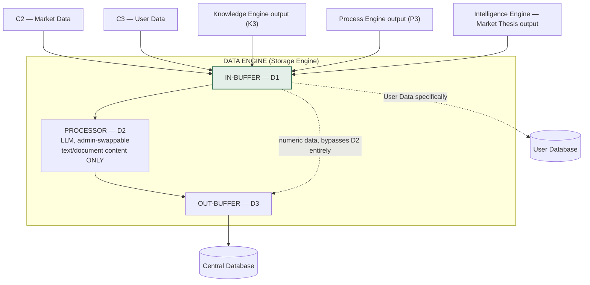
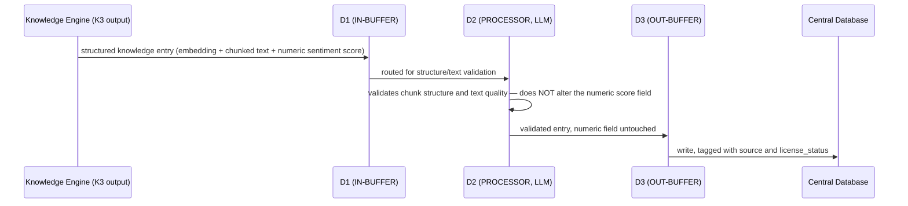
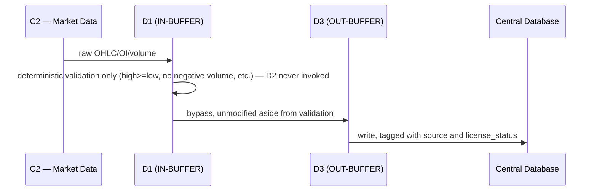

# 03 — Data Engine
## Quants Report — Capinfy Private Limited

> **Naming note, read this first:** this engine was originally named **"Data Engine"** in the earliest architecture documents for this project. The Founder's own architecture diagram, and every document produced after it, renamed this engine to **"Storage Engine."** The role, responsibilities, and components described in this document are unchanged across that rename — this is one engine under two names at different points in the project's history, not two different components. This document uses "Data Engine" in its title (matching the original name and this file's requested subject) and "Storage Engine" throughout the body (matching the current, accepted name), and calls out the distinction wherever it could otherwise cause confusion. See Section 26 for the full decision history.

---

## Table of Contents

1. [Purpose](#1-purpose)
2. [Overview](#2-overview)
3. [Goals](#3-goals)
4. [Scope](#4-scope)
5. [Responsibilities](#5-responsibilities)
6. [Architecture](#6-architecture)
7. [Components](#7-components)
8. [Inputs](#8-inputs)
9. [Outputs](#9-outputs)
10. [Internal Workflows](#10-internal-workflows)
11. [External Workflows](#11-external-workflows)
12. [Business Rules](#12-business-rules)
13. [Database Interaction](#13-database-interaction)
14. [APIs](#14-apis)
15. [AI Logic](#15-ai-logic)
16. [Prompt Logic](#16-prompt-logic)
17. [Error Handling](#17-error-handling)
18. [Security Considerations](#18-security-considerations)
19. [Dependencies](#19-dependencies)
20. [Assumptions](#20-assumptions)
21. [Edge Cases](#21-edge-cases)
22. [Performance Considerations](#22-performance-considerations)
23. [Scalability Considerations](#23-scalability-considerations)
24. [Future Improvements](#24-future-improvements)
25. [Open Questions](#25-open-questions)
26. [Decision History](#26-decision-history)
27. [Glossary](#27-glossary)
28. [References to Related Project Documents](#28-references-to-related-project-documents)

---

## 1. Purpose

The Data Engine (Storage Engine) exists to be the **single point of organization, normalization, validation, and persistence** for every piece of data that enters Quants Report, regardless of which channel or engine it originated from. It is the only engine in the entire system permitted to write to either database directly. Its purpose is as much about enforcing a boundary as it is about storage: nothing reaches a database without passing through this engine's validation first, and nothing about a piece of data's origin or licensing is lost on the way in.

---

## 2. Overview

Quants Report's overall architecture (see `01_Architecture.md`) is built so that engines never communicate with one another directly — only through a shared database. The Data Engine is the engine that makes this possible at all: it is the sole writer to both the Central Database and the User Database. Every other engine's output (Knowledge Engine's structured knowledge, Process Engine's calculated results, Intelligence Engine's Market Thesis output) is routed back through this engine before it is ever persisted.

Internally, the Data Engine follows the same buffer pattern used by every engine in this architecture: an IN-BUFFER, a PROCESSOR, and an OUT-BUFFER — labeled **D1, D2, D3** respectively — plus one structural addition unique to this engine: a direct bridge from D1 to D3 that bypasses D2 entirely for numeric data. This bypass exists for a specific, deliberate reason explained in Section 6 and Section 12.

---

## 3. Goals

- Guarantee that no numeric value is ever modified, reinterpreted, or touched by an AI model on its way into storage.
- Guarantee that every stored record retains a record of where it came from and what it is licensed to be used for, permanently, not just at the moment it was first written.
- Allow new data sources to be added without requiring changes to this engine's internal validation or storage logic, via the Market Data Connector abstraction (Section 7.3).
- Be the only engine that needs to be correct about database-writing for the entire system's "Storage Engine is the sole writer" rule to hold.

---

## 4. Scope

This document covers the Data Engine's internal structure (D1/D2/D3 and the numeric bypass), its role as sole database writer across both databases, the Market Data Connector and Historical Data Store reference implementations, the licensing/provenance model it enforces, and the external data-sourcing research that directly shapes what this engine has to handle (NSE's data policy, broker API restrictions, free prototyping sources).

Out of scope: the column-level schema of either database (a separate future document, see Section 24), and the specific business logic of Knowledge, Process, or Intelligence Engines, which are documented separately and only referenced here where they hand data to this engine.

---

## 5. Responsibilities

| Responsibility | Detail |
|---|---|
| Organize | Accept incoming data from any channel or engine, in whatever shape it arrives. |
| Normalize | Bring incoming data into a consistent internal shape before storage. |
| Validate | Reject malformed data rather than silently correcting it. |
| Store | Write to the appropriate database — Central or User — and only this engine does so. |
| Preserve provenance | Attach and permanently retain source and license-status metadata on every record. |

---

## 6. Architecture



The bypass from D1 directly to D3 is the architecturally significant detail of this engine. It exists because D2 is an AI model, and AI models must never be in the path of a numeric value — even a "normalization" step. Text and document content (news text, knowledge base uploads, user preference strings) goes through D2. Anything numeric (prices, quantities, OI, calculated Greeks) skips D2 entirely and goes straight from D1 to D3 unmodified, aside from the deterministic validation described in Section 17.

---

## 7. Components

### 7.1 D1 — IN-BUFFER
The intake point for all data arriving at this engine, from any source. Stateless — holds data only momentarily before it is either routed to D2 or directly to D3.

### 7.2 D2 — PROCESSOR
An LLM, swappable via the platform's administrative panel, with no exposure to end users. **Scoped strictly to text/document content.** Its job is to organize and normalize unstructured content — for example, validating that a structured knowledge entry (Section 10.1) is well-formed — without ever altering a numeric field contained within a mixed record. A mixed record (e.g., a quantified news item, which carries both a calculated sentiment score and the underlying text) is handled by having D2 validate the structure and text content only; the numeric score field passes through unaltered.

### 7.3 Market Data Connector (reference implementation: `market_data_connector.py`)
The abstraction that allows any data source to be swapped without changing code anywhere else in the system. Defines:

- `MarketDataConnector` — an abstract interface every data source must implement (`get_historical_ohlc`, `get_option_chain`, `health_check`).
- `LicenseStatus` — an enum every connector must declare: `INTERNAL_ONLY`, `LICENSED_RESEARCH_ONLY`, `LICENSED_DISPLAY`, `LICENSED_PERSONAL`.
- `assert_safe_to_publish()` — a method that raises a `PermissionError` automatically if a connector's data is used in a way its license status does not permit.
- `JugaadDataConnector` — the first concrete implementation, wrapping the `jugaad-data` library, tagged `INTERNAL_ONLY`.

```python
class LicenseStatus(Enum):
    INTERNAL_ONLY = "internal_only"
    LICENSED_RESEARCH_ONLY = "licensed_research_only"
    LICENSED_DISPLAY = "licensed_display"
    LICENSED_PERSONAL = "licensed_personal"

class MarketDataConnector(ABC):
    license_status: LicenseStatus

    @abstractmethod
    def get_historical_ohlc(self, symbol, from_date, to_date) -> list[OHLCBar]: ...

    @abstractmethod
    def get_option_chain(self, symbol, expiry) -> list[OptionChainRow]: ...

    def assert_safe_to_publish(self) -> None:
        if self.license_status != LicenseStatus.LICENSED_DISPLAY:
            raise PermissionError(f"{self.__class__.__name__} is '{self.license_status.value}' — not cleared for display.")
```

### 7.4 Historical Data Store (reference implementation: `historical_data_store.py`)
The cleaning, validation, and persistence layer that sits between a connector's raw output and the database. Implements the D1→D2/bypass→D3 pattern concretely for historical OHLC data:

```python
def _is_clean(bar: OHLCBar) -> bool:
    if bar.open <= 0 or bar.high <= 0 or bar.low <= 0 or bar.close <= 0:
        return False
    if bar.high < bar.low:
        return False
    if not (bar.low <= bar.open <= bar.high and bar.low <= bar.close <= bar.high):
        return False
    if bar.volume < 0:
        return False
    return True

def ingest_ohlc(bars, source_name, license_status) -> dict:
    accepted, rejected = 0, 0
    for bar in bars:
        if not _is_clean(bar):
            rejected += 1
            continue
        # ... INSERT OR REPLACE, tagged with source_name, license_status, ingested_at
        accepted += 1
    return {"accepted": accepted, "rejected": rejected, "source": source_name}

def fetch_ohlc(symbol, from_date, to_date, for_publish=False) -> list[OHLCBar]:
    # ... reads stored rows
    for row in rows:
        status = LicenseStatus(row.license_status)
        if for_publish and status != LicenseStatus.LICENSED_DISPLAY:
            raise PermissionError(f"Stored data is '{status.value}' — not licensed for display.")
    # ... returns OHLCBar objects
```

The critical property of `fetch_ohlc`: license status is re-checked **on every read**, not only at write time. Storing data does not change what it is licensed for — a fact confirmed independently by NSE Data & Analytics Limited's own policy (Section 11.1): no access or usage of market data confers ownership over it, regardless of storage or processing.

### 7.5 D3 — OUT-BUFFER
The final, validated form of any record about to be written. Stateless, like D1 — nothing persists here either. The only thing D3 ever does is write to a database.

---

## 8. Inputs

| Source | Content | Path |
|---|---|---|
| C2 — Market Data | Raw OHLC, OI, volume (jugaad-data, future: NSE, GDFL) | → D1, archived; numeric, uses the bypass |
| C3 — User Data | Broker info, holdings, positions, preferences | → D1, split internally (numeric bypasses D2; preference/text fields use D2) |
| Knowledge Engine output (K3) | Structured/embedded knowledge entries, including quantified news items | → D1, text-content path via D2 |
| Process Engine output (P3) | Calculated Greeks/indicators (market-data case) | → D1, numeric, uses the bypass |
| Intelligence Engine output (Market Thesis) | Thesis record (direction, confidence, supporting/invalidation conditions, status) | → D1, routed the same as any other engine's output — not a special case |

---

## 9. Outputs

- **Central Database:** market data, calculated results, platform and quantified-news knowledge entries, instrument-level explanations, Market Thesis records.
- **User Database:** broker credentials, holdings, positions, preferences, personal knowledge base uploads (see `01_Architecture.md`, Section 7.7 and 10.5, for why this is a separate database).
- This engine produces no output to the Widget Layer directly in the normal flow — widgets read from the database(s) it writes to, either via Intelligence Engine or via the approved direct shortcut (Section 13.2).

---

## 10. Internal Workflows

### 10.1 Mixed-Content Record Validation (Quantified News Example)


### 10.2 Pure Numeric Record Validation (Market Data Example)


---

## 11. External Workflows

### 11.1 NSE Data Sharing & Usage Policy (Primary Source)
Directly researched from NSE Data & Analytics Limited's own published policy (updated 11 December 2025), this governs everything this engine stores that originates from NSE-sourced market data:

- No access or usage of market data confers any ownership over it — ownership remains with NSE/NSE Data permanently, regardless of storage or processing. This is the regulatory basis for the `license_status` field traveling with stored data indefinitely (Section 7.4).
- Redistribution is permitted only as specifically agreed in a Subscriber's "Relevant Agreement" with NSE Data — not automatically, and not by default.
- A commercial venture like Quants Report does not qualify for NSE's reduced-fee, non-commercial "Research Entity" track, which is reserved for research conducted for purposes other than trading or profit.
- NSE and NSE Data reserve the right to audit or inspect records and carry out spot checks on data usage and distribution — making the provenance tracking in Section 7.3/7.4 a direct, practical necessity, not a nicety.

### 11.2 Broker API Restrictions (Kite Connect)
Zerodha's Kite Connect developer terms directly constrain what this engine may do with broker-sourced data:

- Sublicensing API access to a third party is explicitly prohibited.
- Credentials are intended for use by one person only — data fetched under one user's credentials must not be cached or served to a different user, even if that second user separately holds their own subscription.
- This is the direct reason the User Database (Section 13) holds broker-sourced personal data per-user, with no cross-user sharing of any broker-derived record, structurally.

### 11.3 Free Prototyping Data Sources
Identified and confirmed during Stage 4 research, for use during internal-only development:

- Historical EOD equity and F&O bhavcopy — free, directly from NSE's own public website, via `jugaad-data`.
- Live/near-real-time option chain — same approach, reading NSE's own public JSON endpoints.
- RBI economic data — also free via `jugaad-data`.
- Explicit caveat: these are unofficial. They read NSE's public website rather than a documented, licensed API. No uptime guarantee; can break without notice if NSE changes its site. Acceptable only for founder-only internal prototyping (`LicenseStatus.INTERNAL_ONLY`) — never a production foundation.

### 11.4 Future Licensed Vendors (Researched, Not Yet Contracted)
- **TrueData** and **Global Datafeeds (GDFL)** — both confirmed, via NSE's own published list of Authorized Realtime Data Vendors, to be legitimately licensed for Futures & Options data, with EOD history available back to 2010 or earlier.
- Both vendors' own terms confirm market data remains "licensed, not owned" even on a paid plan — a paid subscription does not automatically mean a license to display data to end users; research/backtest-only tiers and display-rights tiers are commonly priced and governed separately. The specific tier purchased determines whether ingested data is tagged `LICENSED_RESEARCH_ONLY` or `LICENSED_DISPLAY`.
- **NSE Data & Analytics Limited** also offers distinct categories — "Paid Non-Display Data" and "Paid Analytical Products" — identified as a promising fit for a platform whose output is derived analytics rather than redisplayed raw ticks, but not yet quoted or contracted.

---

## 12. Business Rules

- D2 (the AI processor inside this engine) must never process a numeric field. Numeric data always uses the D1→D3 bypass.
- This engine is the only engine in the entire system permitted to write to either database directly. Every other engine's output is routed back through it first.
- Every record written carries a `source` and a `license_status` field, permanently, and that status is re-checked on every read intended for display — not only at the point of writing.
- Malformed data is rejected outright, never silently corrected.
- Data fetched under one user's broker credentials is never stored or served in a way that could reach a different user.
- The Widgets↔Database direct-write shortcut (Section 13.2) applies to the Central Database only — it must never be extended to the User Database, given the sensitivity of what that database holds.

---

## 13. Database Interaction

### 13.1 Two Databases, One Writer
| Database | Holds | Written By |
|---|---|---|
| Central Database | Market data, calculated results, platform knowledge, quantified news, instrument explanations, Market Thesis records | This engine (Storage Engine), exclusively |
| User Database | Broker credentials, holdings, positions, preferences, personal knowledge base uploads | This engine (Storage Engine), exclusively |

### 13.2 The Widgets↔Database Shortcut
A deliberate, approved exception allows specific widgets to read directly from — and, in one approved case, write directly to — the database, bypassing this engine's normal validate-then-store pipeline. This exception is **scoped to the Central Database only.** Direct, unvalidated writes into the database holding broker tokens and personal holdings were judged a materially different risk than into the database holding cached market summaries or display preferences, and the shortcut was never reasoned through for that level of sensitivity.

### 13.3 Read Access by Other Engines
Knowledge Engine, Process Engine, and Intelligence Engine all read from the Central Database as needed; Intelligence Engine additionally reads from the User Database when a query requires personal context. None of these engines write to either database directly — reads only.

---

## 14. APIs

No formal external API exists for this engine itself (it is an internal architectural component, not a service with its own external endpoint). The external integration points this engine's connectors wrap are:

- `jugaad-data` (unofficial library, not a documented API)
- Zerodha Kite Connect (OAuth + REST API, for broker-sourced data)
- Future: a licensed vendor API (TrueData, GDFL, or an NSE Data-issued Non-Display/Analytical Products feed)

---

## 15. AI Logic

This is the one engine in the system where AI logic exists alongside a hard, structural restriction on where it may operate. D2 is a swappable LLM (Section 7.2), but it operates exclusively on text/document content. There is no AI logic anywhere on the numeric bypass path. This is the most concrete, code-enforced instance of the project-wide rule that no number may originate from or be touched by an AI model.

---

## 16. Prompt Logic

No literal prompt templates exist yet for D2. The architectural constraint any future prompt design must respect: D2's prompts must operate only on text/document fields of a record and must never be given write access, even implicitly, to a numeric field within the same record. A mixed record's numeric field should not even be included in the context passed to D2, as a matter of implementation discipline, not only a behavioral instruction to the model.

---

## 17. Error Handling

- Numeric validation is deterministic and explicit: reject if any price field is non-positive, reject if high is less than low, reject if a value lies outside its own day's high/low range, reject if volume is negative.
- `ingest_ohlc` returns an explicit `{accepted, rejected, source, license_status}` report on every call — a caller always knows what was dropped, rather than silently losing rows.
- `fetch_ohlc(..., for_publish=True)` raises a `PermissionError` (not a silent filter) the moment any matching row is not licensed for display — a partial, silently-incomplete result was judged worse than a loud failure that forces the caller to handle it.
- Not yet defined: behavior when a connector's `health_check()` fails mid-ingestion, or when D2 (the LLM) fails or times out while validating a mixed-content record.

---

## 18. Security Considerations

- Broker credentials and other User-Database content must be encrypted, never stored in plaintext — agreed in principle (`01_Architecture.md`, Section 18), not yet implemented.
- Digital Personal Data Protection Act, 2023 compliance applies directly to this engine's handling of User Database content, since this is the engine that actually writes that data.
- NSE/NSE Data's audit and spot-check rights over data usage and distribution (Section 11.1) mean this engine's provenance tracking is not optional hygiene — it is the actual artifact an audit would request.
- Automated, off-platform backups are agreed in principle for all stored data; no written schedule exists yet (tracked as an open gap in `01_Architecture.md` and the Documentation Standards Checklist).

---

## 19. Dependencies

- `jugaad-data` Python package (development-phase market data source).
- Zerodha Kite Connect (OAuth, and the paid Connect tier specifically for live/historical market data — the free Personal tier is assumed sufficient for holdings/positions/orders only; see Section 20).
- SQLite, as used in the current `historical_data_store.py` reference implementation — explicitly noted there as trivially swappable for PostgreSQL later, same interface.
- Whatever environment actually runs this engine's code must have outbound network access to the relevant external source (NSE's website, the broker's API, or a future licensed vendor's API) — confirmed during this project to not be a given; one development sandbox used earlier could not reach NSE's website at all.

---

## 20. Assumptions

- That Zerodha's free Kite Connect "Personal" tier covers holdings, positions, and order data without requiring the paid Connect subscription. Repeatedly flagged as needing direct verification on the developer portal; not confirmed in this documentation set.
- That `jugaad-data` will continue to function against NSE's public website reliably through the prototype phase, despite carrying no uptime guarantee.
- That NSE Data & Analytics Limited's "Non-Display Data" and "Paid Analytical Products" categories will, on direct inquiry, prove to be a good licensing fit for this engine's eventual production data source. Identified as a promising lead; not yet quoted or confirmed.

---

## 21. Edge Cases

- A mixed-content record (e.g., a quantified news item) where the text/structure is malformed but the numeric score is valid, or vice versa — no defined partial-acceptance behavior yet; current logic implies whole-record rejection, but this has not been explicitly decided.
- A connector swap (e.g., from `JugaadDataConnector` to a future licensed connector) occurring while data is mid-ingestion — no defined behavior yet for in-flight requests during a swap.
- A record whose license status needs to change after the fact (e.g., a vendor relationship is terminated, and previously `LICENSED_DISPLAY` data must revert to a more restrictive status) — no defined mechanism yet for retroactively changing a stored record's license_status.

---

## 22. Performance Considerations

- The numeric bypass (D1→D3 direct) exists partly for correctness (no AI in the numeric path) and partly for performance — deterministic validation is fast, and avoiding an LLM call on every numeric tick avoids both latency and unnecessary AI provider cost.
- This engine sits in the synchronous path for the Market Data fast-lane's archival write (Section 10.2 of `01_Architecture.md`) — writes not directly blocking a waiting user should be made asynchronous as the system grows, per the scalability note below.

---

## 23. Scalability Considerations

- As the sole writer to both databases, this engine is a natural bottleneck candidate as write volume grows. Writes that the user is not directly waiting on (most of them, other than the Market Data fast-path's eventual archival write) should be asynchronous/non-blocking.
- The two-database split already reduces one scaling pressure: User Data's access pattern (per-user, broker-sourced, sensitive) and Central Data's access pattern (shared, derived, high-read-volume) are different enough that isolating them keeps either from constraining the other.

---

## 24. Future Improvements

- A formal, column-level schema for both the Central Database and the User Database.
- A defined mechanism for retroactively changing a stored record's `license_status` (Section 21).
- Direct outreach to NSE Data & Analytics Limited regarding the Non-Display Data and Analytical Products categories, to convert an identified lead into an actual licensing decision.
- A broker-comparison pass beyond Zerodha (Upstox, Angel One, Fyers, Dhan) to confirm whether Kite Connect's sublicensing restriction (Section 11.2) is universal or broker-specific — flagged early in this project and not yet completed.
- Migration of the reference SQLite implementation to PostgreSQL once multi-user concerns make that necessary.

---

## 25. Open Questions

- What is the correct partial-acceptance behavior for a mixed-content record with one valid and one invalid component (Section 21)?
- How should an in-flight connector swap be handled (Section 21)?
- Should licensed-vendor data, once contracted, be ingested through a brand-new connector class only, or should `JugaadDataConnector` remain active in parallel for any internal-only use cases even after a licensed source exists? Not yet decided.

---

## 26. Decision History

| Topic | Earlier Decision | Later / Current Decision | Status |
|---|---|---|---|
| Engine name | "Data Engine" | "Storage Engine" | **Storage Engine is current** — see the naming note at the top of this document. |
| Buffer name | "Room" (IN-ROOM / OUT-ROOM) | "Buffer" (IN-BUFFER / OUT-BUFFER) | **Buffer is current.** |
| Numeric data path | Originally, all data passing through this engine was implied to go through the same D1→D2→D3 path. | A dedicated D1→D3 bypass was added specifically so numeric data never reaches the AI-based D2 processor. | **Bypass is current** — added in direct response to a flagged risk, not part of the original design. |
| Database-writing scope | An early draft had Knowledge Engine and Process Engine writing to the database directly, in parallel with this engine. | Corrected so this engine is the **sole** writer to either database; Knowledge and Process Engine outputs route back through it first. | **Sole-writer model is current.** |
| Database count | Originally a single, central database for all data. | Split into a Central Database and a separate User Database, on the Founder's proposal, due to the higher sensitivity of personal/broker data. | **Two-database model is current.** This engine writes to both, exclusively. |
| Widgets↔Database shortcut scope | Originally approved as a general, undifferentiated shortcut to "the database." | Explicitly scoped to the Central Database only, once the two-database split occurred. | **Central-Database-only is current.** |

---

## 27. Glossary

See `00_Master_Index.md`, Section 8, for the project-wide glossary. Term specific to this document:

| Term | Meaning |
|---|---|
| Numeric bypass | The direct D1→D3 path inside this engine that skips the AI-based D2 processor entirely, used for any numeric field, with no exception. |

---

## 28. References to Related Project Documents

- `00_Master_Index.md` — repository index and shared glossary.
- `01_Architecture.md` — overall system architecture; this document narrows Sections 7.1, 10.2, 10.3, 13, and 26 of that document to this engine specifically.
- `quants-report-engine-specification.md` / `.docx` — the earlier consolidated engine document; this document supersedes its Storage Engine section where detail differs.
- `quants-report-stage4-free-data.html` — the original free-data-source research referenced in Section 11.3.
- `market_data_connector.py`, `historical_data_store.py` — the reference code this document describes in Section 7.
- `quants-report-v1-codex-brief.md` — the current build target, which extends this engine's reference code rather than replacing it.
