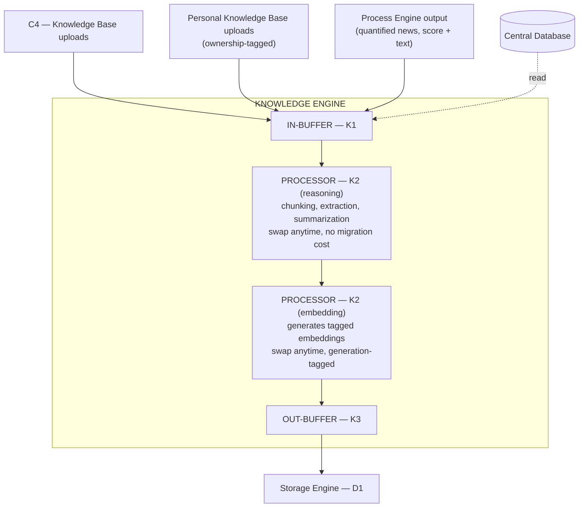
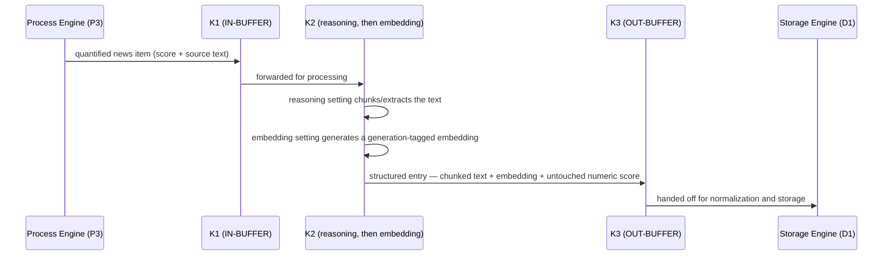
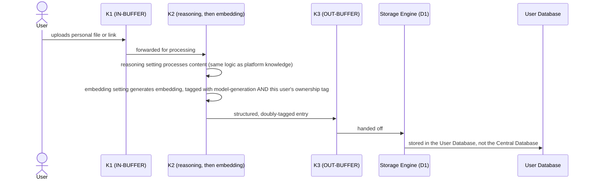

# 04 — Knowledge Engine
## Quants Report — Capinfy Private Limited

---

## Table of Contents

1. [Purpose](#1-purpose)
2. [Overview](#2-overview)
3. [Goals](#3-goals)
4. [Scope](#4-scope)
5. [Responsibilities](#5-responsibilities)
6. [Architecture](#6-architecture)
7. [Components](#7-components)
8. [Inputs](#8-inputs)
9. [Outputs](#9-outputs)
10. [Internal Workflows](#10-internal-workflows)
11. [External Workflows](#11-external-workflows)
12. [Business Rules](#12-business-rules)
13. [Database Interaction](#13-database-interaction)
14. [APIs](#14-apis)
15. [AI Logic](#15-ai-logic)
16. [Prompt Logic](#16-prompt-logic)
17. [Error Handling](#17-error-handling)
18. [Security Considerations](#18-security-considerations)
19. [Dependencies](#19-dependencies)
20. [Assumptions](#20-assumptions)
21. [Edge Cases](#21-edge-cases)
22. [Performance Considerations](#22-performance-considerations)
23. [Scalability Considerations](#23-scalability-considerations)
24. [Future Improvements](#24-future-improvements)
25. [Open Questions](#25-open-questions)
26. [Decision History](#26-decision-history)
27. [Glossary](#27-glossary)
28. [References to Related Project Documents](#28-references-to-related-project-documents)

---

## 1. Purpose

The Knowledge Engine exists to turn unstructured content — documents, news, and (later in this project's design) each individual user's own trading notes and reference material — into structured, retrievable knowledge. It is explicitly **not merely a repository**: its job is to acquire, process, structure, and make searchable, not just to hold files. Every other engine that needs context beyond raw numbers (principally Intelligence Engine) depends on this engine having done that work correctly.

---

## 2. Overview

The Knowledge Engine follows the same internal buffer pattern as every other engine in this architecture: **K1 (IN-BUFFER) → K2 (PROCESSOR) → K3 (OUT-BUFFER)**. Its output is never written directly to a database — like every engine except Storage Engine, its output is routed back through Storage Engine first (see `03_Data_Engine.md`).

This engine's scope expanded significantly over the course of this project. It began, in the earliest architecture documents, as a deliberately small MVP component: "a small curated reference set, not a full ingestion pipeline." It later took on two additional, substantial responsibilities: becoming the second stage of the quantified-news pipeline (Section 10.1), and — in a later, separately-proposed feature — becoming the engine responsible for letting individual users bring and use their own personal knowledge bases (Section 10.2). Both expansions are documented in full below and flagged explicitly in Section 26.

---

## 3. Goals

- Make platform-curated knowledge (uploaded documents, links, books) retrievable by Intelligence Engine without requiring Intelligence Engine to read raw, unstructured source material itself.
- Allow the model used for understanding/chunking content, and the model used for generating embeddings, to each be upgraded independently, without breaking retrieval quality or requiring an all-at-once system-wide migration.
- Allow individual users to bring their own trading knowledge and have it treated as a first-class, personally-owned knowledge source — without ever exposing one user's uploaded material to another user.
- Ensure that news, once quantified by Process Engine, is stored in a form that is both searchable (for future "why did this happen" queries) and permanently linked to the specific numeric score it was quantified into.

---

## 4. Scope

This document covers the Knowledge Engine's internal structure, its two-setting processor design, its role in the quantified-news pipeline, the personal knowledge base feature's architectural requirements, and the copyright/attribution rules that follow from letting users upload their own material.

Out of scope: the column-level schema for how knowledge entries are stored (a future document, see `01_Architecture.md` Section 24), and the prose-generation logic Intelligence Engine uses when it actually composes an explanation from what this engine makes retrievable — that boundary is stated precisely in Section 15, but the composition logic itself belongs to Intelligence Engine's own documentation.

---

## 5. Responsibilities

| Responsibility | Detail |
|---|---|
| Acquire | Accept content from platform-curated sources (C4) and, separately, from individual users' personal uploads. |
| Process | OCR scanned material, chunk long documents, extract metadata, generate embeddings. |
| Structure | Produce a consistent, retrievable representation of whatever content arrives, regardless of original format. |
| Tag | Attach both a model-generation tag (Section 7.2) and, for personal content, an ownership tag (Section 10.2) to every entry. |
| Hand off | Forward all structured output to Storage Engine — never write to a database directly. |

---

## 6. Architecture



K2 is drawn here as two sequential sub-steps (reasoning, then embedding) within the same processor for clarity. They are, per Section 7.2, **independently swappable settings**, not a fixed pipeline order enforced by the architecture — a future implementation could parallelize them or call them separately, as long as the generation-tagging guarantee in Section 7.2 is preserved.

---

## 7. Components

### 7.1 K1 — IN-BUFFER
Intake point for all content arriving at this engine: platform-curated uploads, personal user uploads, and quantified news items forwarded from Process Engine. Stateless, like every buffer in this architecture.

### 7.2 K2 — PROCESSOR (Two Independent Settings)
This is the single most important design decision specific to this engine, reached after a real, identified technical risk.

- **Reasoning model** — performs OCR, chunking, extraction, and summarization. **Swappable at any time, with no migration cost.** Each document is handled independently of every other; swapping this model affects only documents processed after the swap.
- **Embedding model** — generates the vector embeddings used for similarity search/retrieval. **Swappable at any time, but every embedding is tagged with the model-generation that produced it.** The system only ever compares vectors within the same generation. Older content is migrated to a new generation via a background job, on the platform's own timeline — never an instant, forced re-index, and never a moment where search quality degrades.

**Why the split exists:** embeddings from different models occupy genuinely different, incompatible vector spaces. Swapping the embedding model without this safeguard would not produce an error — it would silently return plausible-looking but meaningless search results, because old-model and new-model vectors would be compared against each other as if they were comparable. The reasoning half of K2 carries none of this risk, since each document is processed independently regardless of which model handled it.

```python
# Illustrative, not yet implemented:
class EmbeddingRecord:
    content_id: str
    vector: list[float]
    embedding_model_generation: str   # e.g. "text-embed-v2-2026-03"
    owner_id: str | None              # None for platform knowledge; set for personal uploads

def search(query_vector, query_generation, owner_id=None):
    candidates = [
        e for e in all_embeddings
        if e.embedding_model_generation == query_generation
        and (e.owner_id is None or e.owner_id == owner_id)
    ]
    return rank_by_similarity(query_vector, candidates)
```

### 7.3 K3 — OUT-BUFFER
The final, structured form of any knowledge entry, ready to be handed to Storage Engine. Stateless.

### 7.4 Generation Tag
A permanent attribute of every embedding, recording which embedding model produced it. Never altered after creation. Used to prevent cross-generation vector comparison (Section 7.2).

### 7.5 Ownership Tag
A permanent attribute of every personal-knowledge-base entry (Section 10.2), recording which specific user it belongs to. Independent of, and orthogonal to, the generation tag — an entry has exactly one of each.

---

## 8. Inputs

| Source | Content | Resulting Tag(s) |
|---|---|---|
| C4 — Knowledge Base | Platform-curated uploaded PDFs, books, web links, documents | Generation tag only (no owner — shared platform knowledge) |
| Personal Knowledge Base uploads | A user's own files or links | Generation tag **and** ownership tag |
| Process Engine output (P3, news-specific case) | A quantified news item: a sentiment/impact score plus the original source text | Generation tag only; the numeric score travels with the entry but is not altered by this engine (see `03_Data_Engine.md`, Section 7.2, on how Storage Engine subsequently protects this field) |

---

## 9. Outputs

- **To Storage Engine (K3 → D1):** all structured knowledge, in every case — platform knowledge to the Central Database, personal knowledge base entries to the User Database (Section 13).
- **To Intelligence Engine:** indirectly only, via the database. This engine does not hand content to Intelligence Engine directly — Intelligence Engine reads from whichever database the content was written to, when it needs context (see `01_Architecture.md`, Section 6.1, on the database-as-bus principle).

---

## 10. Internal Workflows

### 10.1 Quantified News → Structured Knowledge

This sequential design (Process Engine quantifies, then Knowledge Engine structures) was a deliberate improvement over an earlier design where news was archived and quantified in parallel, independently. Generating the score and the searchable knowledge representation from one coherent pipeline means they cannot drift out of sync with each other over time.

### 10.2 Personal Knowledge Base Ingestion


### 10.3 Retrieval, Scoped by Ownership
When Intelligence Engine retrieves knowledge context for a query, it reads platform knowledge (no owner tag, or matching the requesting user's view of shared content) and that specific user's own personal knowledge — never another user's personal entries. This is enforced by the ownership tag at the retrieval-filtering step shown in Section 7.2's pseudocode, not by any trust placed in the calling code to ask correctly.

---

## 11. External Workflows

### 11.1 Copyright — Platform-Curated Knowledge
Established early in this project: copyright and licensing are a real, binding constraint on platform-curated knowledge. The platform cannot ingest copyrighted trading courses, books, or videos without an actual license to do so. This remains true regardless of the personal knowledge base feature described below — it governs only what the platform itself curates and distributes to all users, not what an individual user separately uploads for their own use.

### 11.2 Copyright — Personal Knowledge Base
A materially different, and materially lower, risk profile, because the user is processing their own material for their own use — closer to running a personal search tool over one's own files than to the platform republishing someone else's work. This does not eliminate the risk entirely. Two concrete mitigations are required:
- **Terms of Service warranty:** the user must explicitly affirm they have the right to upload whatever they upload.
- **Takedown/removal mechanism:** a way to remove content if that warranty is ever wrong. The specific mechanism is not yet designed (see Section 25).

### 11.3 Attribution Rule for Reflected Personal Content
If Intelligence Engine's response draws on a user's own uploaded material — for example, the user's personal notes, or even old tip-channel screenshots or a paid newsletter the user uploaded themselves — the response must visibly and unambiguously label that content as **the user's own material being reflected back to them.** It must never be blended with, or appear to be, the platform's own analysis. This matters most acutely if the uploaded material contains actual buy/sell calls: reflecting it back without clear attribution would risk making it look like the platform's own voice is making those calls, which it is not and must not appear to be.

### 11.4 No Loosening of Compliance Gates
Allowing personal knowledge sources does not change what the platform is permitted to say in response to a query. The existing rules — instrument-level explanation is safe, position-level interpretation is not; Market Thesis is gated by registration status regardless of input source — apply identically whether the underlying context came from platform knowledge, personal knowledge, or both. A personal upload changes the *input* available to Intelligence Engine; it does not change what Intelligence Engine is allowed to *output*.

---

## 12. Business Rules

- K2's reasoning setting and embedding setting are swappable independently of one another.
- Embeddings are never compared across model-generations. A swap creates a new generation; it does not retroactively invalidate or instantly migrate the old one.
- Every personal knowledge base entry carries an ownership tag, checked on every retrieval, with no exception.
- This engine never writes to a database directly — all output routes through Storage Engine.
- Personal knowledge base content is stored in the User Database, never the Central Database.
- Reflected personal content must always be visibly attributed to the user, never presented as platform analysis.

---

## 13. Database Interaction

| Data | Destination Database | Path |
|---|---|---|
| Platform-curated knowledge (from C4) | Central Database | K1 → K2 → K3 → Storage Engine (D1) → Central DB |
| Quantified news, structured | Central Database | Process Engine (P3) → K1 → K2 → K3 → Storage Engine (D1) → Central DB |
| Personal knowledge base entries | User Database | K1 → K2 → K3 → Storage Engine (D1) → User DB |

This engine also has a confirmed **read** connection from the Central Database (`DB → K1` in the architecture diagram). The specific purpose of this read was not explicitly elaborated in design discussion to date — plausible uses include checking for duplicate or previously-processed content before reprocessing, or retrieving existing taxonomy/metadata to keep new entries consistent with prior ones — but this should be treated as **inferred, not confirmed**, and is listed as an open question in Section 25.

---

## 14. APIs

No formal external API exists for this engine specifically. Its external dependencies are whichever LLM provider is configured for K2's two settings (Section 19), and, for personal knowledge base uploads, whatever file/link ingestion mechanism the Widget Layer's upload UI eventually uses (not yet specified).

---

## 15. AI Logic

Both halves of K2 are AI-based. This is one of the three engine processors in the system (alongside D2 and I2) that is an LLM rather than a fixed calculator — consistent with the project-wide rule that AI is appropriate for understanding, structuring, and explaining content, but never for producing a number. Knowledge Engine produces no numbers; it produces structured, searchable representations of text and documents, which is squarely AI-appropriate work.

**Precise boundary with Intelligence Engine:** Knowledge Engine makes content retrievable. It does not compose explanations, narratives, or answers. When a "why is this instrument moving" query is eventually answered, it is Intelligence Engine that composes the explanation — by retrieving relevant structured knowledge that this engine has made searchable, via a database read. This engine's job ends at "structured and findable"; Intelligence Engine's job begins at "compose a response using what was found."

---

## 16. Prompt Logic

No literal prompt templates exist yet. The constraints any future prompt design for K2 must respect:
- The reasoning setting's prompts operate on whatever document/content is provided — no cross-document context is required for chunking/extraction/summarization.
- The embedding setting does not use natural-language prompts in the conversational sense; it is a direct model call to produce a vector, and its only architectural requirement is that the resulting vector be tagged with the generating model's generation identifier before being handed to K3.

---

## 17. Error Handling

Not yet formally defined. The following are known requirements based on decisions made elsewhere in this project, not yet implemented:
- A failed OCR or extraction step (Section 7.2, reasoning setting) should not silently produce an empty or malformed knowledge entry — should fail loudly, consistent with the project-wide preference (established in `03_Data_Engine.md`, Section 17) for explicit rejection over silent, incomplete success.
- An embedding generation failure should prevent the entry from being marked ready for retrieval, rather than being stored with a missing or null vector that could later cause a retrieval-time error.

---

## 18. Security Considerations

- **Cross-user leakage is the most significant risk specific to this engine.** If the ownership tag (Section 7.5) is ever applied incorrectly, or the retrieval-filtering logic in Section 7.2's pseudocode is ever bypassed, one user's personal knowledge base content could be exposed to another user. This should be treated as a high-severity class of bug, equivalent in seriousness to a broker-credential leak, given that personal knowledge base content could include proprietary trading methodology a user considers sensitive.
- Personal knowledge base content is subject to the same Digital Personal Data Protection Act, 2023 considerations as the rest of the User Database (see `03_Data_Engine.md`, Section 18).
- The takedown mechanism referenced in Section 11.2 is also a security/compliance consideration, not solely a copyright one — it is the platform's recourse if personal content is later found to be unlawful for reasons beyond copyright (e.g., defamatory, or otherwise problematic content uploaded by a user).

---

## 19. Dependencies

- An LLM provider for the reasoning setting of K2 (currently assumed to be the same provider configurable elsewhere in the platform, e.g. Claude, via the admin panel — see `01_Architecture.md`, Section 15).
- An embedding-model provider for the embedding setting of K2 — may be the same or a different provider than the reasoning setting; the architecture treats them as independent.
- OCR tooling, for scanned/image-based document uploads (not yet selected).
- Storage Engine (Section 9; this engine never persists anything itself).

---

## 20. Assumptions

- That generation-tagging and background migration (Section 7.2) will prove sufficient to keep retrieval quality stable across embedding-model swaps at the data volumes this project will actually reach. Not yet tested at real scale.
- That platform knowledge and personal knowledge can share the same K1→K2→K3 pipeline and underlying logic, differing only by the presence or absence of an ownership tag, without requiring materially different processing logic for the two cases. This has not yet been tested against a real personal upload.

---

## 21. Edge Cases

- A document that is both platform-curated and very similar to a personal upload from a specific user (e.g., a widely available trading book the user has also personally uploaded) — no defined deduplication or merge behavior yet.
- A personal knowledge base upload containing third-party copyrighted material the user did not have the right to upload (Section 11.2) — mitigated by ToS warranty and a not-yet-designed takedown mechanism, but the detection of such content (versus relying solely on after-the-fact reports) is not addressed at all yet.
- An embedding-model swap initiated while a previous swap's background migration (Section 7.2) is still in progress — no defined behavior for overlapping migrations (also flagged in `01_Architecture.md`, Section 21).
- A quantified news item (Section 10.1) whose source text is later found to be inaccurate or retracted by its original publisher — no defined update/correction workflow yet.

---

## 22. Performance Considerations

- Chunking and embedding generation are both potentially expensive operations at volume; the generation-tagging design (Section 7.2) was explicitly chosen partly to avoid the cost of a forced, all-at-once re-embedding every time a better model becomes available.
- Retrieval performance depends on the size of the candidate set after generation and ownership filtering (Section 7.2's pseudocode) — no indexing strategy has been specified yet for keeping this fast as the personal-knowledge-base feature grows the total volume of stored embeddings.

---

## 23. Scalability Considerations

- Personal knowledge base content scales with the number of users, not just the amount of platform-curated content — a materially different growth curve than platform knowledge, and one more reason (alongside sensitivity) that this content lives in the User Database rather than the Central Database (see `03_Data_Engine.md`, Section 13).
- The background migration mechanism for embedding-model swaps (Section 7.2) needs to be capable of running incrementally over a large, growing corpus without blocking ordinary ingestion or retrieval — not yet load-tested.

---

## 24. Future Improvements

- A defined deduplication/merge strategy for the edge case in Section 21.
- A designed (not just agreed-in-principle) takedown mechanism for personal knowledge base content.
- An indexing strategy for embedding retrieval at scale.
- A defined update/correction workflow for quantified news items whose source is later retracted or corrected.
- Resolution of the `DB → K1` read connection's exact purpose (Section 13), either by confirming one of the inferred uses or documenting the actual intended one.

---

## 25. Open Questions

- What, precisely, does the Knowledge Engine read the Central Database for (`DB → K1`)? Confirmed to exist in the architecture; purpose not yet documented (Section 13).
- Should platform knowledge and a user's personal knowledge ever be merged or cross-referenced in a single retrieval (e.g., "does my personal note about this stock agree with the platform's own knowledge"), or must they always remain strictly separate retrieval pools? Not yet decided.
- What is the actual takedown mechanism for personal knowledge base content (Section 11.2)? Agreed to be necessary; not yet designed.

---

## 26. Decision History

| Topic | Earlier Decision | Later / Current Decision | Status |
|---|---|---|---|
| Engine scope | "MVP cut: a small curated reference set, not a full ingestion pipeline" (original architecture-vision document). | Expanded to include a full role in the quantified-news pipeline (Section 10.1) and an entire personal-knowledge-base feature for individual users (Section 10.2). | **The expanded scope is current.** The original MVP-cut framing applied to the platform-curated knowledge use case only and has not been revisited as a constraint on the newer use cases. |
| K2 as a single setting | Originally treated as one swappable LLM setting, with the embedding-incompatibility risk unaddressed. | Split into two independent settings — reasoning (freely swappable) and embedding (swappable with generation-tagging and background migration). | **Split-setting model is current.** |
| Output destination | An early draft implied this engine's output (K3) could write to the database directly. | Corrected: K3 always routes through Storage Engine (D1); this engine never writes to a database directly. | **Routed-through-Storage-Engine is current.** |
| Relationship to Intelligence Engine | An early draft showed a direct K3 → Intelligence Engine arrow (a direct context handoff). | Corrected, consistent with the database-as-bus principle: Intelligence Engine reads this engine's stored output from the database; there is no direct engine-to-engine arrow. | **Database-mediated is current.** |
| Personal knowledge base | Did not exist as a concept in earlier architecture documents. | Introduced later in the project as a major proposed feature, with its own ownership-tagging requirement. | **Personal knowledge base is an accepted, current feature** of this engine's design, though not yet built. |

---

## 27. Glossary

See `00_Master_Index.md`, Section 8, for the project-wide glossary. Terms specific to this document:

| Term | Meaning |
|---|---|
| Reasoning setting (K2) | The half of K2 responsible for chunking, extraction, and summarization — freely swappable, no migration required. |
| Embedding setting (K2) | The half of K2 responsible for generating vector embeddings — swappable, but generation-tagged to prevent incompatible vectors from being compared. |
| Ownership tag | A permanent tag on a personal knowledge base entry recording which specific user it belongs to. |

---

## 28. References to Related Project Documents

- `00_Master_Index.md` — repository index and shared glossary.
- `01_Architecture.md` — overall system architecture; this document narrows Sections 7.2, 10.4, 10.5, and 10.6 of that document to this engine specifically.
- `03_Data_Engine.md` — Storage Engine, which this engine's output always routes through, and which ultimately determines which database (Central or User) any given knowledge entry lands in.
- `quants-report-engine-specification.md` / `.docx` — earlier consolidated engine document; this document supersedes its Knowledge Engine section where detail differs, per Section 26 above.
- `quants-report-pillars.pdf` — original source of the copyright/licensing constraint on platform-curated knowledge (Section 11.1).
