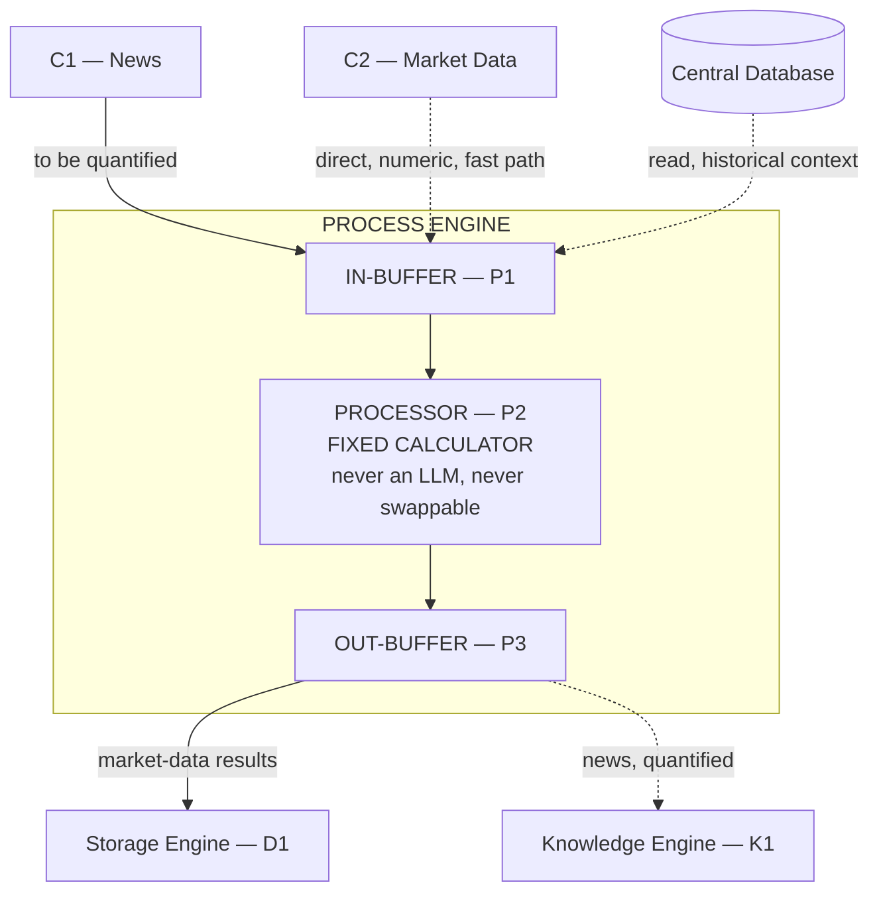
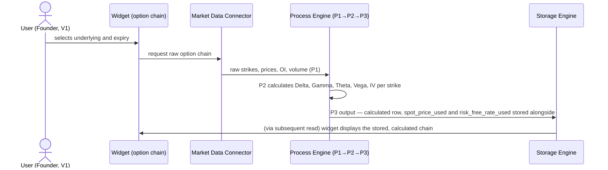
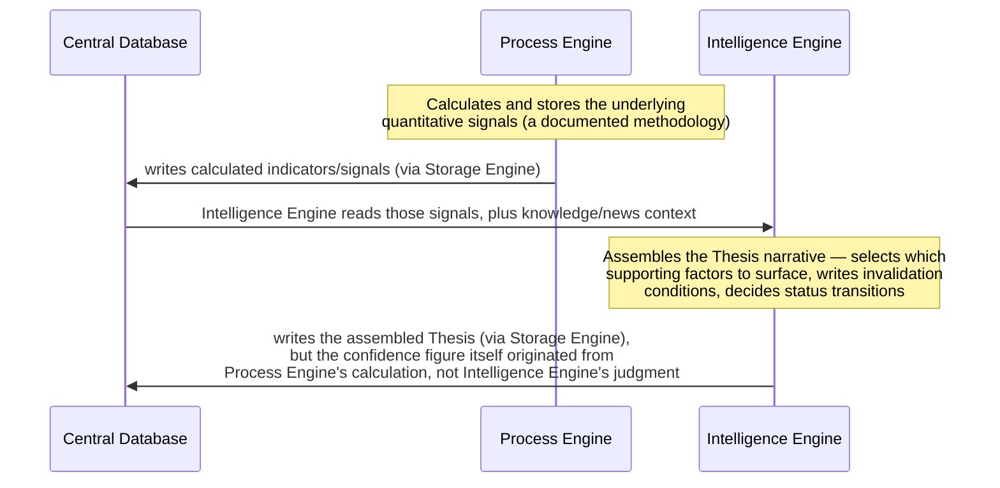

# 05 — Process Engine
## Quants Report — Capinfy Private Limited

---

## Table of Contents

1. [Purpose](#1-purpose)
2. [Overview](#2-overview)
3. [Goals](#3-goals)
4. [Scope](#4-scope)
5. [Responsibilities](#5-responsibilities)
6. [Architecture](#6-architecture)
7. [Components](#7-components)
8. [Inputs](#8-inputs)
9. [Outputs](#9-outputs)
10. [Internal Workflows](#10-internal-workflows)
11. [External Workflows](#11-external-workflows)
12. [Business Rules](#12-business-rules)
13. [Database Interaction](#13-database-interaction)
14. [APIs](#14-apis)
15. [AI Logic](#15-ai-logic)
16. [Prompt Logic](#16-prompt-logic)
17. [Error Handling](#17-error-handling)
18. [Security Considerations](#18-security-considerations)
19. [Dependencies](#19-dependencies)
20. [Assumptions](#20-assumptions)
21. [Edge Cases](#21-edge-cases)
22. [Performance Considerations](#22-performance-considerations)
23. [Scalability Considerations](#23-scalability-considerations)
24. [Future Improvements](#24-future-improvements)
25. [Open Questions](#25-open-questions)
26. [Decision History](#26-decision-history)
27. [Glossary](#27-glossary)
28. [References to Related Project Documents](#28-references-to-related-project-documents)

---

## 1. Purpose

The Process Engine exists to be the **only** component in the entire Quants Report system permitted to produce a number shown to a user — a Greek, an indicator, a risk metric, a quantified sentiment score, or a probability/confidence value of any kind. Every other engine in this architecture is designed, in one way or another, around protecting this one engine's exclusivity. Its purpose is not merely "do the math" — it is to be the single, auditable place where the answer to "why this number and not another" is always answerable with a documented method, never with "the AI decided."

---

## 2. Overview

The Process Engine follows the same buffer pattern as every engine in this architecture: **P1 (IN-BUFFER) → P2 (PROCESSOR) → P3 (OUT-BUFFER).** It is unique among the four engines in one specific, load-bearing way: **P2 is a fixed, deterministic calculator — never an LLM, never swappable.** Every other engine's processor (D2, K2, I2) is an AI model that can be changed via an administrative setting. P2 cannot be, under any circumstance currently agreed in this project.

This engine sits in two distinct workflows: the **real-time, latency-sensitive calculation path** for market data (Greeks, indicators), and the **quantification step** for news, where unstructured text is converted into a defined, documented numeric score before it ever reaches Knowledge Engine for structuring.

---

## 3. Goals

- Guarantee that every numeric output in the system traces to a stated, reproducible methodology.
- Provide real-time Greek and indicator calculation fast enough to support a live, refreshable widget, without waiting on a database round-trip.
- Convert news content into a numeric signal using a method that can be documented and defended, never an unstructured model judgment presented as if it were a calculation.
- Remain the sole, trusted source of any quantitative signal that Intelligence Engine later explains or assembles into higher-level output such as a Market Thesis.

---

## 4. Scope

This document covers the Process Engine's internal structure, its two input paths (fast-path market data, and news quantification), its calculation responsibilities (Greeks, indicators, sentiment scoring), its role as the numeric foundation underneath Market Thesis, and the specific, known-correct test case used to validate its first implemented calculation.

Out of scope: the actual narrative composition of a Market Thesis or an instrument explanation (Intelligence Engine's responsibility, documented separately) and the column-level schema of where this engine's output is stored (`02_Database.md`).

---

## 5. Responsibilities

| Responsibility | Detail |
|---|---|
| Calculate | Greeks (Delta, Gamma, Theta, Vega), implied volatility, indicators, risk metrics. |
| Quantify | Convert news content into a defined, documented sentiment/impact score. |
| Validate | Perform a sanity check on fast-path numeric data that bypassed Storage Engine's own validation. |
| Ground | Be the sole source of any number that Intelligence Engine later explains, narrates, or assembles into a higher-level construct such as Market Thesis. |

---

## 6. Architecture



---

## 7. Components

### 7.1 P1 — IN-BUFFER
Intake for two distinct kinds of input: raw market data arriving via the fast path (Section 8.1), and raw news content awaiting quantification (Section 8.2). Stateless, like every buffer in this architecture.

### 7.2 P2 — PROCESSOR (Fixed Calculator)
**The single most important component in this entire architecture.** Never an LLM. Never an admin-swappable setting, in deliberate, explicit contrast to D2, K2, and I2. Performs:

- **Greek and implied volatility calculation**, using Black-Scholes (single stocks) or Black-76 (index options — the same model used by Sensibull, a comparable commercial product).
- **Sentiment/impact scoring for news**, using a stated, documented method (a calibrated classifier, a rules-based lexicon score, or a defined statistical model) — never an unstructured LLM call whose output is then treated as if it were a calculation.
- **The sanity check on fast-path market data** that bypassed Storage Engine's own validation (Section 11.1), since nothing else checks that data before it is used.

```python
# Illustrative structure, not yet implemented:
def calculate_greeks(spot, strike, time_to_expiry, risk_free_rate, implied_vol, option_type, model="black_scholes"):
    """
    model: "black_scholes" for single stocks, "black_76" for index options.
    Returns a dict: {delta, gamma, theta, vega, implied_volatility}.
    Every input here must be traceable — store spot, time_to_expiry, and
    risk_free_rate alongside the result (see 02_Database.md, option_chain_snapshot).
    """
    ...

def quantify_news_sentiment(text, method="documented_lexicon_v1"):
    """
    method must always name a specific, stated, reproducible technique.
    Never: "ask an LLM and treat its answer as the score."
    Returns a numeric score plus a record of which method produced it.
    """
    ...
```

### 7.3 P3 — OUT-BUFFER
The finished, calculated result, ready to be routed onward. Stateless. Its destination depends on what triggered the calculation (Section 9).

---

## 8. Inputs

### 8.1 Market Data — Fast Path
C2 → P1 directly, in parallel with Storage Engine's separate archival path for the same raw data. This bypasses the database round-trip specifically for latency-sensitive, user-is-waiting calculation (e.g., refreshing a live option chain). Because this path skips Storage Engine's own validation, P2 performs its own sanity check on this data before calculating anything from it.

### 8.2 News — Quantification
C1 → P1 directly. Unlike market data, this is not a "fast path" in the latency sense — it is the **first and only step** at which raw news content is converted into a number, before being handed onward to Knowledge Engine (Section 9).

### 8.3 Historical Context — Database Read
This engine reads from the Central Database as needed (e.g., historical price bars for a volatility calculation, or previously calculated indicators relevant to a new calculation). This is a read-only relationship — this engine never writes to the database directly (Section 13).

---

## 9. Outputs

| Trigger | Destination | Routing |
|---|---|---|
| Market-data-triggered calculation (Greeks, indicators) | Storage Engine (D1) | `P3 → D1`, normalized and persisted to the Central Database via the numeric bypass (`03_Data_Engine.md`, Section 6) |
| News-triggered calculation (quantified score) | Knowledge Engine (K1) | `P3 → K1`, so the score and the resulting searchable knowledge entry are generated from one coherent pipeline (`04_Knowledge_Engine.md`, Section 10.1) |

This engine never writes to a database directly, and never hands output directly to Intelligence Engine or to the Widget Layer — both of those consume this engine's output only via a subsequent database read, consistent with the database-as-bus principle (`01_Architecture.md`, Section 6).

---

## 10. Internal Workflows

### 10.1 Option Chain Greeks Calculation


### 10.2 News Quantification
See `04_Knowledge_Engine.md`, Section 10.1, for the full sequence. This engine's specific role within it: receive raw news text (P1), apply a documented scoring method (P2), and forward the score plus the original text onward to Knowledge Engine (P3) — never to Storage Engine directly for this case.

---

## 11. External Workflows

### 11.1 Relationship to Storage Engine's Validation
Storage Engine validates data passing through its own D1→D2/bypass→D3 path. The market-data fast path (Section 8.1) skips that validation entirely in the interest of latency. P2's sanity check exists specifically to cover this gap — it is the only validation this specific data receives before being used in a calculation.

### 11.2 Relationship to Intelligence Engine and Market Thesis
This is the most architecturally sensitive relationship this engine has, and it is documented here precisely because it is easy to misstate.

The Founder's own description of Market Thesis generation is: *"Market Thesis is derived from all already available data... from DB, so the flow looks like this, from DB → Intelligence Engine → back to DB (stored as Thesis)."* This is correct and accepted as the data-flow description. **It does not mean Intelligence Engine is permitted to invent the thesis's confidence number itself.** The "already available data" Intelligence Engine reads from the database includes signals that only this engine is permitted to have calculated in the first place — option-implied probability, breadth indicators, OI-change metrics, put-writing intensity, or whatever specific statistical inputs a thesis's confidence is ultimately built from.



**The exact statistical methodology for aggregating multiple signals into one Market Thesis confidence figure has not yet been designed.** This is explicitly flagged as unresolved in Section 25 — it is a materially harder problem than a single-instrument Greeks calculation, since it requires combining several distinct signals (breadth, put-writing, institutional activity, price-vs-VWAP) into one defensible number, and no specific method for that aggregation has been agreed yet. The governing principle (Process Engine calculates it; Intelligence Engine never invents it) is settled; the specific formula is not.

---

## 12. Business Rules

- P2 is never an LLM and is never an admin-swappable setting, under any circumstance currently agreed in this project.
- Any number shown to a user — including a Market Thesis confidence figure — must trace to a calculation performed by this engine, even when a different engine (Intelligence Engine) is responsible for assembling the surrounding narrative.
- News is quantified using a named, documented method. An LLM's free-form judgment about a headline's sentiment, used directly as a score, does not satisfy this rule.
- Fast-path market data must be sanity-checked by P2 before any calculation is performed on it, since it has not passed through Storage Engine's own validation.
- This engine never writes to a database directly, and never hands its output directly to the Widget Layer or to Intelligence Engine — only via the database (Storage Engine being the actual writer).

---

## 13. Database Interaction

| Direction | Detail |
|---|---|
| Read | This engine reads from the Central Database as needed — most plausibly for historical price data feeding a volatility calculation, or previously stored indicators feeding a new calculation. The exact set of read queries has not been formally specified yet (see Section 25). |
| Write | None, directly. All output is routed through Storage Engine (`P3 → D1` for market-data results, `P3 → K1` for news, which itself then routes through Storage Engine — see `04_Knowledge_Engine.md`). |

---

## 14. APIs

No external API is exposed by this engine. Its inputs arrive via the Market Data Connector abstraction (`03_Data_Engine.md`, Section 7.3) and the News channel; it has no dependency on any AI provider API, since P2 contains no AI component.

---

## 15. AI Logic

**None.** This is the one engine in the system, by design, with zero AI logic anywhere inside its processor. This is the load-bearing fact that makes the rest of the system's AI usage safe — three engines may use swappable LLMs freely (`01_Architecture.md`, Section 15) precisely because this one engine's exclusivity over numeric output is never compromised.

---

## 16. Prompt Logic

Not applicable. P2 has no prompts, because it has no AI model.

---

## 17. Error Handling

- The sanity check on fast-path data (Section 8.1) should reject malformed input the same way Storage Engine's own validation does (`03_Data_Engine.md`, Section 17) — non-positive prices, impossible high/low relationships, negative volume.
- **Not yet defined:** behavior when an implied-volatility solver fails to converge (a known, real possibility with numerical IV-solving methods such as Newton-Raphson, particularly for deep in/out-of-the-money or near-expiry options) — should this return a null/flagged value, or fail the entire row?
- **Not yet defined:** behavior when a news item's content is too short, too ambiguous, or otherwise produces a low-confidence quantification result — no fallback or confidence-threshold behavior has been specified.

---

## 18. Security Considerations

No security considerations specific to this engine beyond those already covered system-wide (`01_Architecture.md`, Section 18) — this engine has no AI provider dependency, no credential storage, and no direct database write access, which inherently limits its security surface relative to the other three engines.

---

## 19. Dependencies

- A documented, implementable options-pricing model: Black-Scholes (single stocks) and Black-76 (index options).
- A documented, implementable news-sentiment scoring method — not yet selected (lexicon-based, calibrated classifier, or statistical model are all named as candidates; none has been chosen).
- Spot price and risk-free rate as calculation inputs. For the V1 build (`quants-report-v1-codex-brief.md`), the risk-free rate is explicitly a configurable constant, not a live feed — a deliberate scope reduction for the first build, not a permanent design decision.
- Read access to the Central Database for historical context (Section 13).

---

## 20. Assumptions

- That a single, documented news-sentiment scoring method can adequately serve the "quantify the qualitative" goal stated as this project's central technical thesis from its earliest framing. Not yet validated against real news data.
- That Black-Scholes/Black-76 Greeks, calculated from the configurable-constant risk-free rate used in V1, will be accurate enough for the first build's validation purpose, with a live risk-free-rate feed deferred to a later iteration.
- That the eventual Market Thesis confidence methodology (Section 11.2) can be designed and validated to the same "defensible, reproducible" standard already achieved for Greeks calculation, despite being a harder, multi-signal aggregation problem. Not yet attempted.

---

## 21. Edge Cases

- Implied volatility solver non-convergence (Section 17).
- A news item with no clear, calculable sentiment (e.g., a purely factual announcement with no inherent positive/negative framing) — no defined scoring behavior for this case.
- An option chain with missing or stale strikes (e.g., a strike with no recent trade) — no defined behavior for whether to calculate Greeks against a stale last price, skip the row, or flag it.
- A Market Thesis input signal (Section 11.2) that is itself missing or stale at the moment a thesis is being assembled — no defined fallback.

---

## 22. Performance Considerations

- Greek calculation for a full option chain (potentially dozens of strikes) must complete fast enough to support a live, on-demand widget refresh — the V1 Software Requirements Specification names a sub-5-second target for the prototype phase specifically (not a high-frequency trading system requirement).
- Calculating Greeks per-strike in a loop versus a vectorized calculation across the whole chain at once is an implementation choice with real performance consequences at scale; not yet decided, and not a concern for V1's expected volume.

---

## 23. Scalability Considerations

- As more instruments and more users require simultaneous calculation, this engine's compute load scales independently of database write volume (since most of its work, other than the final P3 hand-off, does not touch a database at all). This is a different scaling profile from Storage Engine and is not yet load-tested.
- The eventual Market Thesis aggregation methodology (Section 11.2), once designed, may be materially more compute-intensive per instrument than a single Greeks calculation, given it combines multiple signals — worth accounting for when that design work happens, not assumed to be free.

---

## 24. Future Improvements

- Select and document the specific news-sentiment scoring method (Section 19) — currently named as a category of options, not a chosen implementation.
- Design the Market Thesis confidence aggregation methodology (Section 11.2) — the single largest piece of unfinished design work attributable to this engine.
- Replace the V1 configurable-constant risk-free rate with a live feed.
- Define IV solver non-convergence handling (Section 17).

---

## 25. Open Questions

- What is the actual, chosen news-sentiment scoring method? Named as a category (lexicon, classifier, or statistical model); not yet chosen.
- What is the actual statistical methodology for Market Thesis confidence (Section 11.2)? The principle governing it is settled; the formula is not.
- What, precisely, does this engine read the Central Database for (Section 13)? Plausible uses are stated; no formal query specification exists yet.
- Should a low-confidence or non-convergent calculation result be stored at all, or suppressed entirely until it can be recalculated? Not yet decided.

---

## 26. Decision History

| Topic | Earlier Decision | Later / Current Decision | Status |
|---|---|---|---|
| P2's nature | Implied, in the earliest architecture drafts, that all four engines' processors could plausibly be AI-based (the original framing emphasized AI-provider-agnosticism broadly). | Explicitly and permanently fixed: P2 is a deterministic calculator, never an LLM, never swappable — the one deliberate exception to the otherwise AI-flexible processor design. | **Fixed-calculator-only is current,** and is treated as foundational rather than revisable. |
| Market Thesis confidence origin | The Founder's data-flow description ("DB → Intelligence Engine → back to DB") could be read, in isolation, as Intelligence Engine generating the confidence figure itself. | Clarified in this document: the data flow description is correct, but the confidence figure itself must still originate from this engine's calculation; Intelligence Engine assembles the narrative around a number it does not invent. | **The clarified division is current** — this is an explanation of what was always intended, not a reversal of the Founder's description, but it is stated explicitly here because the shorthand version is easy to misread. |

---

## 27. Glossary

See `00_Master_Index.md`, Section 8, for the project-wide glossary. Terms specific to this document:

| Term | Meaning |
|---|---|
| Fast path | The direct route from Market Data (C2) to this engine, bypassing the database round-trip, for latency-sensitive calculation. |
| Quantification | The act of converting raw news text into a defined, documented numeric score — this engine's specific job in the news pipeline. |

---

## 28. References to Related Project Documents

- `00_Master_Index.md` — repository index and shared glossary.
- `01_Architecture.md` — overall architecture; Sections 7.3, 10.2, 10.7, and 15 of that document are expanded in detail here.
- `03_Data_Engine.md` — Storage Engine, which routes this engine's market-data output to the Central Database.
- `04_Knowledge_Engine.md` — Knowledge Engine, which receives this engine's news-quantification output and is responsible for composing explanations from retrieved context — a boundary stated precisely in Section 11.2 above and Section 15 of that document.
- `02_Database.md` — defines `option_chain_snapshot` and `market_thesis`, the tables this engine's calculated output ultimately populates.
- `quants-report-v1-codex-brief.md` — the current build target, including the known-correct Black-Scholes test case (spot=100, strike=100, T=1yr, r=5%, vol=20% → Delta≈0.6368, Gamma≈0.0188, Theta≈-6.41, Vega≈37.52) used to validate this engine's first implementation.
