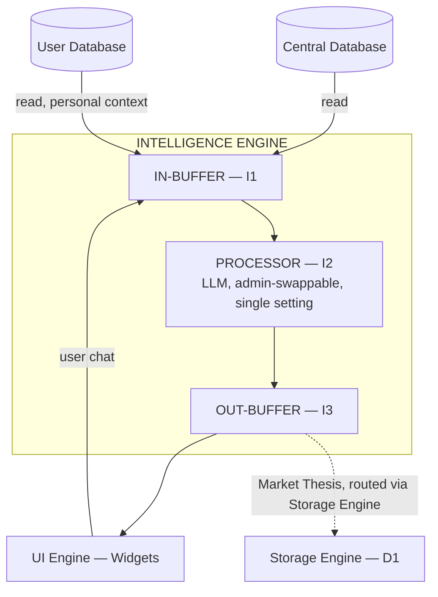
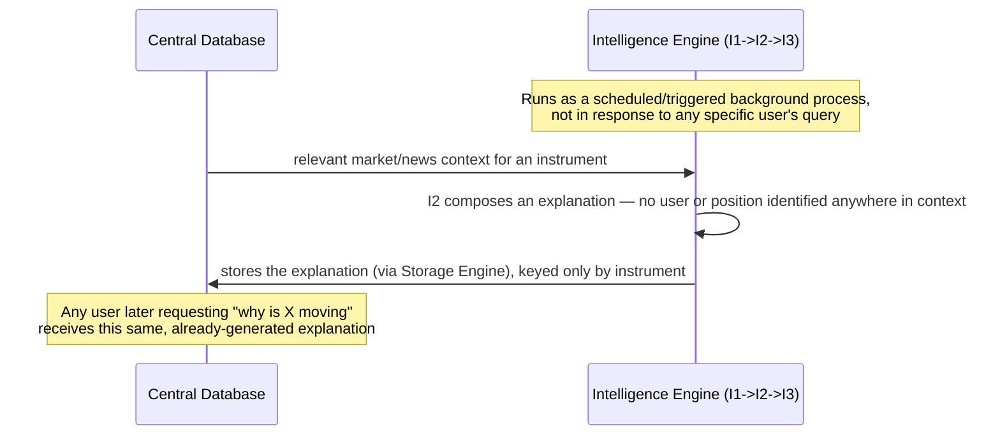
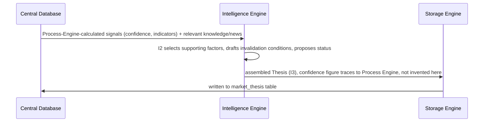

# 06 — Intelligence Engine
## Quants Report — Capinfy Private Limited

---

## Table of Contents

1. [Purpose](#1-purpose)
2. [Overview](#2-overview)
3. [Goals](#3-goals)
4. [Scope](#4-scope)
5. [Responsibilities](#5-responsibilities)
6. [Architecture](#6-architecture)
7. [Components](#7-components)
8. [Inputs](#8-inputs)
9. [Outputs](#9-outputs)
10. [Internal Workflows](#10-internal-workflows)
11. [External Workflows](#11-external-workflows)
12. [Business Rules](#12-business-rules)
13. [Database Interaction](#13-database-interaction)
14. [APIs](#14-apis)
15. [AI Logic](#15-ai-logic)
16. [Prompt Logic](#16-prompt-logic)
17. [Error Handling](#17-error-handling)
18. [Security Considerations](#18-security-considerations)
19. [Dependencies](#19-dependencies)
20. [Assumptions](#20-assumptions)
21. [Edge Cases](#21-edge-cases)
22. [Performance Considerations](#22-performance-considerations)
23. [Scalability Considerations](#23-scalability-considerations)
24. [Future Improvements](#24-future-improvements)
25. [Open Questions](#25-open-questions)
26. [Decision History](#26-decision-history)
27. [Glossary](#27-glossary)
28. [References to Related Project Documents](#28-references-to-related-project-documents)

---

## 1. Purpose

The Intelligence Engine exists to explain, contextualize, and converse — never to calculate. It is the engine that turns Process Engine's numbers and Knowledge Engine's structured content into something a trader can actually read and understand, and it is the engine responsible for Quants Report's most ambitious proposed feature, Market Thesis. Its purpose is bounded as precisely as its capability: it may reason about evidence already produced by other engines, but it may never become the source of a number, and it must never compose advice personalized to one user's specific financial situation without the registration that would permit that.

---

## 2. Overview

The Intelligence Engine follows the same buffer pattern as every other engine: **I1 (IN-BUFFER) → I2 (PROCESSOR) → I3 (OUT-BUFFER).** I2 is an LLM, swappable via the administrative panel, with a single setting — unlike Knowledge Engine, this engine does not generate embeddings, so no generation-tagging split is required here.

This engine never communicates with another engine directly. It retrieves everything it needs from the database. This is stated explicitly in the project's own architecture memo: *"The Intelligence Engine never directly communicates with other engines. Instead, it retrieves all required information from the database."* Its output, in turn, goes either to the Widget Layer (explanation, conversation) or — for Market Thesis specifically — back into the database, routed through Storage Engine like every other engine's persisted output.

---

## 3. Goals

- Explain Process Engine's numbers in language a trader can use, without ever inventing a number of its own.
- Compose Market Thesis as a structured, falsifiable view (direction, confidence, supporting evidence, explicit invalidation conditions) rather than a bare directional signal.
- Keep every explanation it composes on the safe side of the instrument-level/position-level line (Section 12).
- Support cost-efficient reuse of previously generated reasoning across users asking substantially the same question, without ever letting that reuse cross a compliance boundary that fresh generation would also have to respect.

---

## 4. Scope

This document covers the Intelligence Engine's internal structure, its read-only relationship to both databases, the Market Thesis feature in full (including its unresolved methodology question), the Intelligence Cache concept, the instrument-level/position-level compliance distinction that governs everything this engine is permitted to compose, and its relationship to personal knowledge base content.

Out of scope: the actual statistical methodology for Market Thesis confidence (owned by Process Engine, tracked as an open item in `05_Process_Engine.md`) and the rendering of this engine's output (owned by the UI Engine, `07_UI_Engine.md`).

---

## 5. Responsibilities

| Responsibility | Detail |
|---|---|
| Explain | Compose plain-language explanations of Process Engine's calculated output. |
| Converse | Handle direct user chat, retrieving whatever database context a query requires. |
| Assemble Market Thesis | Compose the narrative (supporting factors, invalidation conditions, status) around a confidence figure it does not itself calculate. |
| Monitor | Continuously re-evaluate already-active theses as new information enters the database. |
| Retrieve safely | Filter personal knowledge base retrieval by ownership tag; never surface one user's personal content to another. |
| Stay within the compliance line | Compose only instrument-level, backward-looking content for unregistered/general use; never personalized, forward-looking interpretation of a specific user's position. |

---

## 6. Architecture



---

## 7. Components

### 7.1 I1 — IN-BUFFER
Receives database-read results (Section 8) and direct user chat input. Stateless, like every buffer in this architecture.

### 7.2 I2 — PROCESSOR
A single LLM setting, admin-swappable, with no end-user exposure to the choice of model. Performs all of this engine's actual reasoning: composing explanations, holding conversations, assembling Market Thesis narratives, and deciding thesis status transitions.

```python
# Illustrative, not yet implemented:
def compose_instrument_explanation(symbol, retrieved_context) -> str:
    """
    retrieved_context must contain no information identifying any specific
    user or position. Same symbol, same context -> same explanation,
    regardless of who eventually reads it.
    """
    ...

def assemble_market_thesis(symbol, calculated_signals, retrieved_knowledge) -> ThesisDraft:
    """
    calculated_signals are Process-Engine-produced (confidence, indicators) --
    this function selects which supporting factors to surface, drafts
    invalidation conditions, and proposes a status, but does not invent
    the confidence figure itself.
    """
    ...
```

### 7.3 I3 — OUT-BUFFER
Two distinct destinations, depending on what was generated:
- **Explanation or conversational output** → the Widget Layer.
- **Market Thesis output** → Storage Engine (D1), for persistence in the Central Database — not a direct write, and not a special-cased exception to the "Storage Engine is the sole writer" rule (Section 26).

### 7.4 Intelligence Cache
A cost-and-correctness mechanism, not a separate engine: previously generated reasoning (a daily market outlook, a sector summary, an option chain interpretation, or any other "frequently asked" analysis) is reused rather than regenerated from scratch for every user asking a substantially similar question under the same market conditions. Cache entries should be invalidated when the underlying thesis status changes, or when relevant market data changes meaningfully — not left to go stale indefinitely.

---

## 8. Inputs

| Source | Content | Notes |
|---|---|---|
| Central Database (read) | Calculated results, structured knowledge, quantified news, previously generated instrument explanations | This engine's primary source of "evidence" to reason over. |
| User Database (read) | Personal context — holdings, personal knowledge base entries — filtered by ownership tag | Used only when a specific query requires personal context. |
| Widget Layer (direct) | User chat messages | The one input this engine receives that does not come via a database read. |

---

## 9. Outputs

| Output | Destination | Routing |
|---|---|---|
| Explanation, conversational response | Widget Layer | `I3 → Widgets`, direct |
| Market Thesis (direction, confidence narrative, supporting factors, invalidation conditions, status) | Central Database | `I3 → D1 (Storage Engine) → Central Database`, never a direct write |

---

## 10. Internal Workflows

### 10.1 Instrument-Level Explanation, Generated Requester-Blind

This design makes a key compliance property structural rather than a matter of self-discipline: because no user or position exists in the generation context, the output cannot be personalized, regardless of how the prompt is later refined. Whether this runs eagerly for every instrument or lazily on first request is a cost decision (Section 22), not a compliance one — both preserve the same property.

### 10.2 Market Thesis Generation

See Section 12 and `05_Process_Engine.md`, Section 11.2, for the precise division of labor this workflow depends on.

### 10.3 Continuous Thesis Monitoring
An already-created thesis must be re-evaluated as new information enters the database (e.g., a new news item, a changed indicator, a price move past an invalidation condition). **The exact trigger mechanism — re-evaluation on every new related data point, on a fixed schedule, or some other rule — has not been decided** (Section 25). What is decided: re-evaluation follows the same I1→I2→I3 shape as initial generation, and any change to the thesis's confidence figure must still originate from a fresh Process Engine calculation, never from Intelligence Engine revising the number on its own judgment.

### 10.4 Personal-Context-Aware Conversation
When a user's chat message requires personal context (their own holdings, their own uploaded knowledge), this engine reads from the User Database, filtered by that user's ownership tag (`04_Knowledge_Engine.md`, Section 7.2's retrieval logic). If the response incorporates the user's own uploaded material, it must be visibly labeled as such (Section 12).

---

## 11. External Workflows

No external-party-facing workflow exists for this engine directly — all of its inputs arrive via internal database reads or internal widget chat, and all of its outputs are consumed internally (by the Widget Layer or by Storage Engine).

---

## 12. Business Rules

- This engine never produces a number. Every confidence figure, score, or quantitative signal it presents originates from Process Engine and is retrieved, not invented.
- **The instrument-level/position-level test governs everything this engine composes:** would the exact same explanation make sense for someone who does not hold the position in question? If yes, it is safe, general market information. If the explanation only makes sense because it concerns a specific person's specific holding, it is advice-shaped and requires Investment Adviser registration — not yet in place.
- Instrument-level explanations must be generated blind to the requester — the generation context must never include information identifying a specific user or their position.
- Market Thesis output is gated by `platform_regulatory_status.ra_registered`, checked independently of the requesting user's subscription plan.
- Cached or reused reasoning is gated by exactly the same rule as freshly generated reasoning — reuse changes cost, not compliance status. A cached thesis shown to 100 users is, if anything, a cleaner example of "research distributed broadly" than a freshly generated one.
- Personal knowledge base content is never retrieved across users; a query's results are always filtered to platform knowledge and that specific user's own content only.
- Reflected personal content is always visibly attributed, never blended with this engine's own analysis without distinction.
- This engine has no role whatsoever in the order-status display workflow (`01_Architecture.md`, Section 11.2) — that screen is explicitly neutral, fact-only, with no AI interpretation layered on top, by design.

---

## 13. Database Interaction

| Database | Access | Purpose |
|---|---|---|
| Central Database | Read only | Calculated results, structured/platform knowledge, quantified news, prior instrument explanations, existing Market Thesis records. |
| User Database | Read only | Personal context (holdings, personal knowledge), filtered by ownership tag. |

This engine writes to neither database directly. Market Thesis output is handed to Storage Engine (`I3 → D1`), which is the only component that ever performs the actual write.

---

## 14. APIs

This engine's only external dependency is whichever LLM provider is configured for I2 (Section 19). It exposes no API of its own.

---

## 15. AI Logic

This is one of three engines in the system using a swappable LLM (alongside D2 and K2), and the one whose AI logic carries the most product-facing weight, since its entire job is reasoning and composition rather than structuring (Knowledge Engine) or normalizing (Storage Engine). The model comparison research conducted earlier in this project — noting that Claude Sonnet 4.6 led recorded performance on a finance-specific agent benchmark among models compared — is directly relevant to which model is configured for I2 specifically, given this engine's job is financial reasoning and explanation. No final model selection has been locked in as a permanent decision; `admin_llm_config` (`02_Database.md`, Section 7.8) allows this to change at any time.

---

## 16. Prompt Logic

No literal prompt templates exist yet. The constraints established elsewhere in this project that any future prompt design for I2 must respect:
- Instrument-explanation prompts must never include user- or position-identifying information (Section 10.1).
- Market Thesis assembly prompts must be given Process-Engine-calculated signals as inputs, never asked to produce a confidence figure as part of their own output.
- Personal-context prompts must include only the requesting user's own ownership-tagged content, never another user's.

---

## 17. Error Handling

Not yet formally defined. Known requirements, not yet implemented:
- A failed or low-confidence Market Thesis assembly attempt should not silently produce a thesis with an unsupported or fabricated-sounding narrative — no defined fallback yet.
- A conversational query that requires personal context the user has not yet provided (e.g., no broker connected, no personal knowledge uploaded) should be handled gracefully rather than failing or hallucinating that context.

---

## 18. Security Considerations

- Ownership-tag filtering on personal knowledge retrieval (Section 12) is this engine's specific implementation responsibility for preventing the cross-user leakage risk flagged as high-severity in `04_Knowledge_Engine.md`, Section 18.
- This engine's conversational surface is a plausible target for prompt injection attempts (e.g., a user attempting to make the engine produce advice-shaped or fabricated-number output through clever phrasing) — not yet addressed by any specific mitigation in this project's prior discussion; flagged here as a gap, not a solved problem.

---

## 19. Dependencies

- An LLM provider for I2, configurable via the admin panel (`07_UI_Engine.md`, Section 7.3).
- Read access to both databases.
- Storage Engine, for persisting Market Thesis output.
- Process Engine, as the upstream source of every calculated signal this engine reasons over or assembles into a thesis.

---

## 20. Assumptions

- That the instrument-level/position-level test (Section 12) is sufficient, on its own, to keep this engine's output on the correct side of the Investment Adviser registration line in practice, once implemented in real prompts and real retrieval logic. Not yet tested against adversarial or ambiguous real queries.
- That Intelligence Cache reuse (Section 7.4) can be implemented without inadvertently personalizing supposedly-general cached content — an assumption that depends on the same generation-blindness discipline as Section 10.1, applied consistently to every cached artifact, not just instrument explanations specifically.

---

## 21. Edge Cases

- A user's chat message blends an instrument-level question with an implicit reference to their own position (e.g., "why is this stock dropping, by the way I own a lot of it") — no defined behavior for detecting and separating these two halves of a single message.
- A Market Thesis whose underlying Process-Engine signal changes mid-assembly (flagged already in `01_Architecture.md`, Section 21, as a race condition) — this engine is the one actually performing the assembly when this could occur, and no defined behavior exists yet.
- A prompt-injection attempt specifically aimed at getting this engine to state a fabricated confidence figure as if it were Process-Engine-derived (Section 18).

---

## 22. Performance Considerations

- Pre-computing instrument-level explanations (Section 10.1) trades background compute cost for near-zero latency on the user-facing read — an explicit, deliberate trade named in `01_Architecture.md`, Section 22.
- Whether to generate eagerly (every instrument, on a schedule) or lazily (on first request, then cached) is explicitly identified as the Founder's cost decision to make, not a compliance requirement either way (Section 10.1).

---

## 23. Scalability Considerations

- Intelligence Cache (Section 7.4) is the primary mechanism keeping this engine's LLM cost from scaling linearly with user count for substantially similar queries — without it, 100 users asking the same question under the same market conditions would mean 100 separate, redundant LLM calls.
- Continuous thesis monitoring (Section 10.3), once its trigger mechanism is decided, needs to scale with the number of simultaneously active theses, not just the number of users — not yet load-considered.

---

## 24. Future Improvements

- Decide the trigger mechanism for continuous thesis monitoring (Section 10.3).
- Design a concrete mitigation for prompt-injection risk on the conversational surface (Section 18).
- Define behavior for the blended instrument/position question edge case (Section 21).
- Complete the Investment Adviser registration research needed before this engine can ever compose personalized, position-level interpretation (tracked at the project level in `01_Architecture.md`, Section 24).

---

## 25. Open Questions

- What exactly triggers re-evaluation of an active Market Thesis (Section 10.3)? Not yet decided.
- Should eager or lazy generation be used for instrument-level explanations (Section 10.1, Section 22)? Identified as the Founder's cost decision; not yet made.
- How should a blended instrument/position question (Section 21) be detected and handled?
- What is the actual statistical methodology Process Engine will use for Market Thesis confidence, which this engine depends on but does not own? Tracked as open in `05_Process_Engine.md`, Section 25; repeated here because this engine cannot finish its own Market Thesis design without it.

---

## 26. Decision History

| Topic | Earlier Decision | Later / Current Decision | Status |
|---|---|---|---|
| Relationship to Process Engine | An early architecture draft showed a direct arrow from this engine to Process Engine, handing over context before a calculation (and a direct return arrow afterward, for explanation). | Superseded by the database-as-bus principle: this engine never communicates with Process Engine directly in either direction. It reads from the database both for context that informs a thesis and for results it explains — the same database-read pattern, not two different handoffs. | **Database-only access is current.** The conceptual distinction between "gathering context" and "explaining a result" still exists in what this engine does with what it reads, but it is no longer implemented as two different direct-arrow handoffs. |
| Market Thesis persistence | Initially an open architectural gap — this engine had no database write path of any kind, only a route to the Widget Layer. | Resolved: this engine's Market Thesis output is routed through Storage Engine (`I3 → D1`), the same pattern every other engine's output already follows — not a new, separate write exception. | **Routed-through-Storage-Engine is current.** |
| Market Thesis confidence origin | The Founder's shorthand description of the data flow ("DB → Intelligence Engine → back to DB") could be read as this engine generating the confidence figure itself. | Clarified: the confidence figure must still originate from Process Engine's calculation; this engine assembles the surrounding narrative without inventing the number. | **The clarified division is current** — see `05_Process_Engine.md`, Section 26, for the same decision recorded from Process Engine's side. |

---

## 27. Glossary

See `00_Master_Index.md`, Section 8, for the project-wide glossary. Term specific to this document:

| Term | Meaning |
|---|---|
| Generation-blind | Describes content composed with no information about who might eventually read it — the property that makes instrument-level explanations structurally incapable of being personalized. |

---

## 28. References to Related Project Documents

- `00_Master_Index.md` — repository index and shared glossary.
- `01_Architecture.md` — overall architecture; Sections 10.6, 10.7, and 15 are expanded in detail here.
- `05_Process_Engine.md` — the upstream source of every number this engine reasons over or assembles into Market Thesis; Section 11.2 of that document and Section 12 of this one describe the same division of labor from each engine's side.
- `04_Knowledge_Engine.md` — the source of structured/platform knowledge and personal knowledge base content this engine retrieves; Section 11.3 of that document and Section 12 of this one describe the same attribution rule.
- `02_Database.md` — defines `market_thesis`, `instrument_explanation`, and `platform_regulatory_status`, the tables this engine's output ultimately depends on or populates.
- `07_UI_Engine.md` — where this engine's explanation and conversational output is actually rendered.
