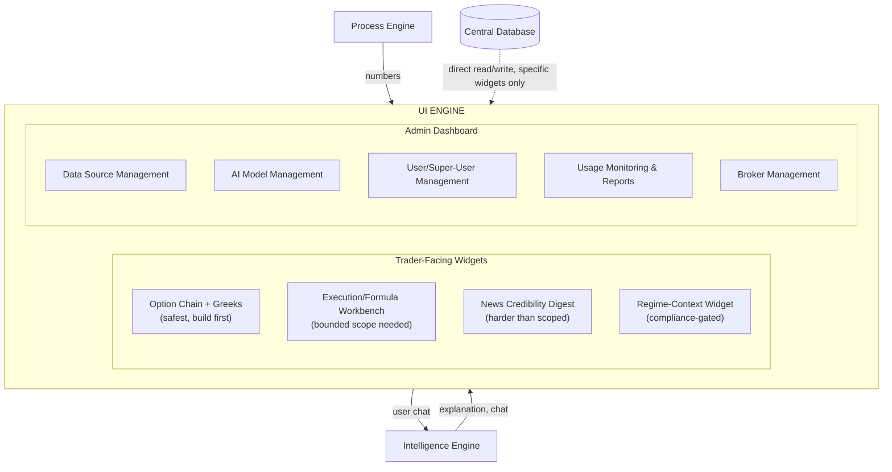
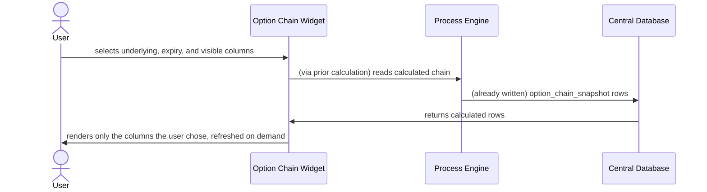

# 07 — UI Engine
## Quants Report — Capinfy Private Limited

---

## Table of Contents

1. [Purpose](#1-purpose)
2. [Overview](#2-overview)
3. [Goals](#3-goals)
4. [Scope](#4-scope)
5. [Responsibilities](#5-responsibilities)
6. [Architecture](#6-architecture)
7. [Components](#7-components)
8. [Inputs](#8-inputs)
9. [Outputs](#9-outputs)
10. [Internal Workflows](#10-internal-workflows)
11. [External Workflows](#11-external-workflows)
12. [Business Rules](#12-business-rules)
13. [Database Interaction](#13-database-interaction)
14. [APIs](#14-apis)
15. [AI Logic](#15-ai-logic)
16. [Prompt Logic](#16-prompt-logic)
17. [Error Handling](#17-error-handling)
18. [Security Considerations](#18-security-considerations)
19. [Dependencies](#19-dependencies)
20. [Assumptions](#20-assumptions)
21. [Edge Cases](#21-edge-cases)
22. [Performance Considerations](#22-performance-considerations)
23. [Scalability Considerations](#23-scalability-considerations)
24. [Future Improvements](#24-future-improvements)
25. [Open Questions](#25-open-questions)
26. [Decision History](#26-decision-history)
27. [Glossary](#27-glossary)
28. [References to Related Project Documents](#28-references-to-related-project-documents)

---

## 1. Purpose

The UI Engine is the product layer of Quants Report — the only part of the system a trader or an administrator actually sees and touches. Its purpose is to render the four underlying engines' work as usable product, without ever becoming a source of calculation or reasoning itself. Its other, equally important purpose, established directly from the Founder's own trading history: bad UI/UX is not cosmetic — it has directly caused real financial losses in the Founder's own past trading, by surfacing the wrong metric at the wrong moment. This engine exists to make sure that never happens inside Quants Report.

---

## 2. Overview

Architecturally, the UI Engine is realized as the **Widget Layer** — described, after explicit review, as a sixth construct that sits *above* the five engines rather than beside or replacing them. Engines are the capability layer; widgets are the product layer. A widget is a composition that consumes the engines beneath it through their already-defined interfaces — it never calculates a number itself, and it never reasons independently of Intelligence Engine.

This engine has two distinct audiences and surfaces: **trader-facing widgets** (the option chain widget, and a planned catalogue of others) and an **administrator-facing dashboard** (data source management, AI model management, user management, usage monitoring). Both are UI Engine responsibilities; they are documented together in this file because both follow the same underlying composition rule, even though their content is entirely different.

---

## 3. Goals

- Every widget must be small enough to ship independently — the project's adopted MVP unit is the widget, not the pillar or the engine.
- No widget may calculate a number or compose an explanation itself — both must come from the engines beneath it.
- Every widget must carry an explicit readiness tag (safe to build now / needs grounding work / compliance-gated) before it is built, not after.
- The interface must be fast, clean, focused, and consistent across every widget — explicitly stated as a design philosophy, not an afterthought: every component must justify its own existence.
- Widgets must be customizable where the Founder's own trading experience showed customization mattered (Section 10.1).

---

## 4. Scope

This document covers the Widget Layer's architectural position, the widget catalogue defined to date with its readiness classifications, the cross-cutting design language all widgets must share, the Admin Panel and User Login surfaces (both UI Engine responsibilities), and the specific compliance- and attribution-related display rules that apply at this layer regardless of which widget is rendering them.

Out of scope: the actual visual design system (colors, typography, component library) — explicitly identified as not yet existing anywhere in this project (see `00_Master_Index.md`, Section 11) — and the full feature-level business logic behind the Admin Panel and Login systems, which belongs in their own future, dedicated specification documents.

---

## 5. Responsibilities

| Responsibility | Detail |
|---|---|
| Render | Display engine output (numbers, explanations, knowledge) as usable product. |
| Compose, never calculate | Assemble a widget's view from engine outputs; never compute a value independently. |
| Maintain design consistency | Apply the same layout, control, and performance standard across every widget. |
| Gate display, not just data | Enforce feature-level gates (e.g., Market Thesis registration status) at the point of rendering, in addition to whatever data-level gates already apply upstream. |
| Attribute correctly | Visibly distinguish a user's own content from the platform's own analysis wherever both could appear together. |

---

## 6. Architecture

---

## 7. Components

### 7.1 The Widget, as a Construct
A widget is a UI Engine composition. It consumes Process Engine's calculated numbers, Intelligence Engine's explanation/conversation, and — for specific, approved cases only — reads directly from the Central Database (Section 13). It never performs its own calculation and never bypasses an engine's defined interface to take a shortcut to raw data or computation. This restriction exists specifically to prevent what was identified, when the Widget-First philosophy was reviewed, as the main scalability risk of this layer: if each widget were allowed its own shortcut to data or calculation, the platform would end up with many inconsistent implementations of "what's the probability" instead of one trusted one.

**Before any widget is approved for building, it must pass a number-source audit:** for every figure it displays, name which engine produced it. A widget that cannot answer this for one of its own displayed values is not ready to build.

### 7.2 Widget Catalogue (Current)
| Widget | Maps To Founder-Validated Pain Point | Readiness |
|---|---|---|
| Option Chain + Greeks | Greeks/option-chain complexity, UI/UX-driven errors | **Safest, most ready — current build target.** Free data path, transparent calculation, zero compliance gating. |
| Execution / Formula Workbench | Excel-based manual execution gap | Strong concept, needs a tightly bounded scope — real risk of growing into "build a no-code platform" if left open-ended. |
| Source-Credibility News Digest | Information overload is fundamentally a trust/verification problem, not a volume problem | Harder than originally scoped — this is a verification problem, not a summarization one. |
| Cross-Cutting Visualization Standard | Wrong metric, wrong time, real financial losses | Not a standalone widget — a design principle every other widget must inherit (Section 7.4). |
| Regime-Change Context Widget | Late recognition of trend/regime shifts (the Founder's own COVID-era loss) | **Most resonant, most dangerous.** A forward-looking directional call — the same thing gated behind Research Analyst registration. Build only as "faster context once a shift is confirmed," never as "prediction that a shift is coming." |

### 7.3 Admin Dashboard
A distinct UI surface from the trader-facing widgets, serving the platform operator rather than an end user. Founder-specified feature list, given in full and not yet reduced to a formal spec document:

- **Admin Profile Management.**
- **Create and manage Platform Users / Super Users** — Super Users may themselves create users, implemented at the schema level via `admin_users.created_by` (`02_Database.md`, Section 8.2).
- **Add and manage News Sources.**
- **Add and manage Knowledge Sources and Knowledge Files.**
- **Add and manage Market Data Sources** — the UI front-end for swapping the active `MarketDataConnector` (`03_Data_Engine.md`, Section 7.3), turning a code change into a dropdown selection.
- **Add and manage LLMs**, for every engine and any user-facing widget that uses one. Must expose Knowledge Engine's two K2 settings (reasoning and embedding) as **separate, distinct controls** — collapsing them into one control in this UI would silently reintroduce the embedding-incompatibility risk that the two-setting design exists to prevent (`04_Knowledge_Engine.md`, Section 7.2).
- **Monitor all usage and generate reports**, for both users and the platform as a whole — the UI surface for `usage_audit_log` (`02_Database.md`, Section 8.8).
- **Add and manage Brokers** (OAuth configuration for multiple brokers).

### 7.4 User Login & Plan Selection
Also founder-specified, given in full:

- **Broker OAuth** — the user-facing half of the Bring Your Own Broker connection.
- **Plan selection and payment wall**, with four tiers: Free Trial (7 days), Premium (extended usage limit), Professional (unlimited usage + premium support), Ultimate (enterprise-level, contact-us).
- **Unlock all platform functionality**, including opening and interacting with widgets, once a plan is selected.
- **Connect to broker** to display the user's own data and to send/receive order and execution updates.

**Hard rule on this surface, established after direct review:** plan tier must never gate Market Thesis or any confidence/probability output. It governs usage volume and support level only. Whether Market Thesis is shown to a given user is decided exclusively by `platform_regulatory_status.ra_registered` (`02_Database.md`, Section 7.6) — a check that is completely independent of which plan that user is on, including the Ultimate tier.

### 7.5 Cross-Cutting Design Language
Stated explicitly as a platform-wide UI principle: every widget shares **standardized layout, embedded AI chat, consistent controls, minimal design, high performance.** No unnecessary visual elements. Every component must justify its own existence. The stated objective, in four words: **fast, clean, focused, consistent.**

---

## 8. Inputs

| Source | Content |
|---|---|
| Process Engine | Calculated numbers (Greeks, indicators, Market Thesis confidence) — never invented by this engine itself. |
| Intelligence Engine | Explanation text, conversational responses, assembled Market Thesis narrative. |
| Central Database (direct, specific widgets only) | Already-computed data for widgets that don't require fresh reasoning on every view (Section 13). |
| The user | Chat input, widget configuration choices (e.g., which option-chain columns to display), login/OAuth actions, order creation. |

---

## 9. Outputs

- Rendered widgets and dashboard views, to the user or administrator.
- User chat messages, forwarded to Intelligence Engine (`I1`).
- Configuration writes — e.g., `user_preferences.widget_column_config` (`02_Database.md`, Section 8.6) — via the approved direct-write shortcut (Section 13).
- Order creation requests, forwarded into the order-routing workflow (`01_Architecture.md`, Section 11.2) — this engine displays and collects order details but never submits an order to a broker itself; that step happens on the broker's own platform, independently, by the user.

---

## 10. Internal Workflows

### 10.1 Option Chain Widget — Customization and Display
Directly traceable to the Founder's own validated pain point: *"I really wish I had a live option chain, a good quality one which I can customise according to my trading style — UI/UX plays a big role, I learned that the hard way by looking at wrong metrics and taking wrong actions."*

The column-selection behavior is stored in `user_preferences.widget_column_config` and persists across sessions.

### 10.2 Attributed Personal Knowledge Display
When Intelligence Engine's response draws on a user's own uploaded personal knowledge (`04_Knowledge_Engine.md`, Section 11.3), this engine is responsible for rendering that distinction visibly — for example, a labeled section or visual treatment that unambiguously marks "from your own notes" separately from "platform analysis." This is a UI Engine implementation responsibility flowing directly from a Knowledge Engine business rule; the rule is decided there, but it can only actually be enforced here, at render time.

### 10.3 Neutral Order Status Display
Per the order-routing workflow (`01_Architecture.md`, Section 11.2, step 8): order status (filled, rejected, or otherwise) is displayed through neutral, easy-to-understand infographics — **no suggestions, no notifications, no interpretation.** This is a direct UI Engine constraint, not a generic style preference: adding any interpretive language to this specific screen (e.g., "this fill was at a bad price") would cross from neutral reporting into advice-shaped content, the exact line established in that workflow's compliance reasoning.

---

## 11. External Workflows

### 11.1 Broker OAuth Login Flow
The user-facing entry point into the Bring Your Own Broker model (`01_Architecture.md`, Section 11.1). The user authenticates directly with their broker (e.g., Zerodha); this engine never collects or handles the user's broker password itself — only the resulting OAuth token, stored encrypted in `broker_connections` (`02_Database.md`, Section 8.3).

### 11.2 Order Creation and Independent Execution
This engine supports steps 1–5 and 7–8 of the order-routing workflow (login, fetch account data, analyze, create the order, review it once more) and displays the result of step 7 (execution details received via API). **Step 6 — actual execution — happens entirely outside this engine**, on the broker's own platform, after the user independently re-authenticates there. This engine never renders a "place order" action that itself submits to the exchange.

---

## 12. Business Rules

- No widget calculates a number or composes an explanation independently of the engines beneath it.
- Every widget must pass a number-source audit before being approved for build.
- Plan tier never gates Market Thesis or probability/confidence content — only `platform_regulatory_status.ra_registered` does, checked independently of billing.
- The order-status display never includes suggestions, notifications, or interpretive language of any kind.
- Personal knowledge content reflected back to a user must always be visibly attributed as such, never blended with platform analysis.
- The Admin Dashboard's LLM management screen must expose Knowledge Engine's reasoning and embedding model settings as separate controls, never one combined control.
- This engine never submits an order to a broker; execution happens only on the broker's own platform.

---

## 13. Database Interaction

The approved Widgets↔Database direct shortcut (`01_Architecture.md`, Section 13.2) allows specific widgets to read from — and, in one approved case, write to — the database without going through Intelligence Engine. This is explicitly scoped to the **Central Database only.**

**Flagged inconsistency, carried over from `02_Database.md`, Section 14.2, and repeated here because it is directly relevant to this engine's implementation:** the one approved direct-write use case (saving a user's widget column preferences) is, by its nature, User Database content — yet the shortcut's approved scope is Central-Database-only. This needs a decision before the option chain widget's customization feature (Section 10.1) is built: either the shortcut's scope is explicitly extended to cover this one specific User Database table, or `user_preferences` is relocated to the Central Database despite being keyed to an individual user. Not yet resolved.

---

## 14. APIs

This engine exposes no external API. It is the consumer-facing surface of the platform itself, not a service called by anything else.

---

## 15. AI Logic

This engine contains no AI logic of its own. "Embedded AI chat" (Section 7.5) refers to Intelligence Engine's conversational interface, rendered inside a widget — the AI reasoning happens in Intelligence Engine; this engine only renders the conversation and forwards the user's messages to it (`I1`).

---

## 16. Prompt Logic

Not applicable. This engine does not call an LLM directly under any circumstance.

---

## 17. Error Handling

Not yet formally defined for this engine specifically. Known requirements, not yet implemented:
- A widget whose underlying calculated data failed to load (e.g., Process Engine's calculation for the current chain is missing or stale) should communicate this state honestly rather than silently displaying outdated numbers as if they were current.
- A failed broker OAuth attempt (Section 11.1) needs a defined user-facing failure state — not yet specified.

---

## 18. Security Considerations

- The Admin Dashboard's user/permission management (Section 7.3) must enforce least-privilege roles, consistent with the system-wide security agreement (`01_Architecture.md`, Section 18) — a compromised Admin account should not automatically mean total platform compromise.
- Login and OAuth-related UI flows are the practical front door for the rate-limiting and credential-handling rules already agreed at the architecture level; this engine is where those rules must actually be enforced at point of entry.

---

## 19. Dependencies

- Process Engine (calculated numbers), Intelligence Engine (explanation, chat, Market Thesis narrative), and the Central Database (for the approved direct-read/write shortcut).
- Zerodha Kite Connect's OAuth flow, for the broker login screen (Section 11.1).
- A not-yet-selected frontend framework/component library — no decision has been made or referenced anywhere in this project's prior discussion.

---

## 20. Assumptions

- That a single, shared design language (Section 7.5) is sufficient across both the trader-facing widget catalogue and the Admin Dashboard, despite their very different audiences and content. Not yet tested with a real design.
- That the option chain widget's manual-refresh model (rather than continuous live-streaming) is acceptable for V1 — consistent with the V1 Codex Brief's explicit scope, but a real constraint on this engine's first implementation.

---

## 21. Edge Cases

- A user's session remains open on a Market Thesis view at the exact moment their trial expires or `ra_registered` changes — flagged already in `02_Database.md`, Section 22, as a database-level point-in-time check; this engine is where the actual user-facing consequence (what happens to an already-rendered view) would need to be handled, and it is not yet defined here either.
- A widget configured to show columns that no longer exist in the underlying calculated data (e.g., after a schema change) — no defined fallback.

---

## 22. Performance Considerations

- The option chain widget's refresh should complete within the sub-5-second target named in the Software Requirements Specification for the prototype phase.
- "High performance" is stated as one of the five cross-cutting design principles (Section 7.5) for every widget, not only the first one — this should be treated as a standing requirement for the catalogue as it grows, not a one-time target for V1 alone.

---

## 23. Scalability Considerations

- As the widget catalogue grows beyond the current five entries (Section 7.2), the number-source-audit and defined-interface-only rules (Section 7.1) are what keep additional widgets from each reinventing their own, potentially inconsistent, way of getting data or calculations — this is the primary scalability safeguard at this layer, not a performance or infrastructure mechanism.
- The Admin Dashboard's user-management screens will need to scale from "the Founder, alone" to a real multi-user, multi-admin base at some point — not a V1 concern, but worth noting that no multi-tenancy consideration has been designed into this engine's UI yet.

---

## 24. Future Improvements

- A real visual design system — colors, typography, component library — none of which exists yet anywhere in this project.
- Resolution of the `user_preferences` database-shortcut-scope inconsistency (Section 13).
- A defined failure state for broker OAuth errors (Section 17).
- A defined behavior for a widget configured against columns that no longer exist (Section 21).
- Formal specification documents for the Admin Dashboard and User Login/Plan systems, both currently documented here only at the level the Founder originally specified them, not as full feature specs.

---

## 25. Open Questions

- Should `user_preferences` move to the Central Database, or should the shortcut's scope explicitly extend to this one User Database table? (Same open question as `02_Database.md`, Section 26 — repeated here since it directly blocks this engine's first customization feature.)
- What frontend framework or component approach will actually be used? Not referenced anywhere in prior discussion.
- What is the user-facing behavior when a session is already open on gated content at the exact moment that content becomes gated (Section 21)?

---

## 26. Decision History

| Topic | Earlier Decision | Later / Current Decision | Status |
|---|---|---|---|
| Widget Layer's architectural position | Not present as a distinct concept in the earliest five-engine architecture documents. | Introduced as a sixth construct, explicitly sitting above the five engines rather than beside or replacing them, after the Founder's own pain points were reframed around "one widget per problem." | **Sixth-construct-above-the-engines is current.** |
| MVP unit | Originally framed at the pillar level ("Pillar 1, narrowed to one workflow"). | Refined to the widget level — explicitly identified as a better-sized, more shippable MVP unit than a pillar. | **Widget-level is current.** |
| K2 admin control granularity | Not addressed at the UI level in earlier documents (the two-setting split was an engine-level decision). | This document specifies, for the first time, that the Admin Dashboard must expose the two K2 settings as separate controls — a UI-level consequence of an engine-level decision that had not previously been stated explicitly at this layer. | **Separate-controls requirement is newly stated here,** consistent with and required by the engine-level decision in `04_Knowledge_Engine.md`. |

---

## 27. Glossary

See `00_Master_Index.md`, Section 8, for the project-wide glossary. No additional terms specific to this document beyond those already defined there and in the engine-specific documents it references.

---

## 28. References to Related Project Documents

- `00_Master_Index.md` — repository index and shared glossary.
- `01_Architecture.md` — overall architecture; Sections 6, 11.2, and 13.2 are expanded in detail here.
- `02_Database.md` — defines the tables this engine reads from and writes to, including the flagged `user_preferences` inconsistency repeated in Section 13 above.
- `03_Data_Engine.md`, `04_Knowledge_Engine.md`, `05_Process_Engine.md` — the engines this layer composes; this document assumes their interfaces rather than redefining them.
- `quants-report-v1-codex-brief.md` — the current build target, the option chain widget, whose UI behavior is specified in Section 10.1 above.
- `quants-report-pillars.pdf`, `quants-report-stage1-pain-point-discovery.html` — original source of the founder-validated pain points this document's widget catalogue (Section 7.2) maps to.
